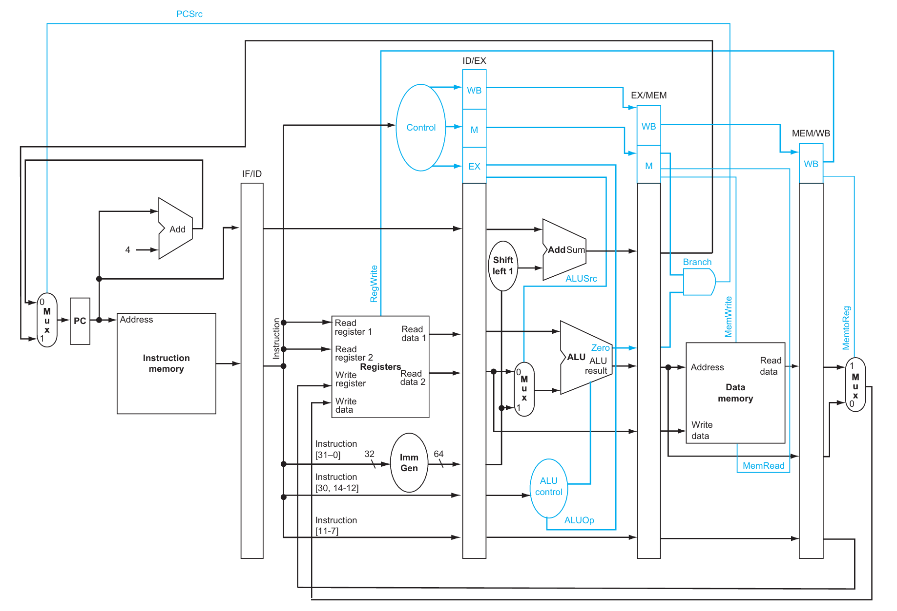
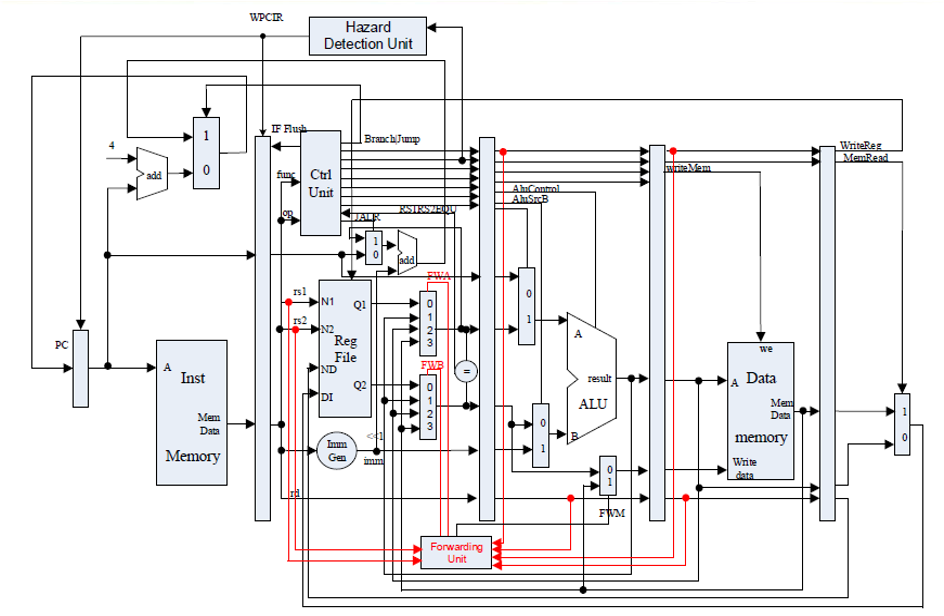
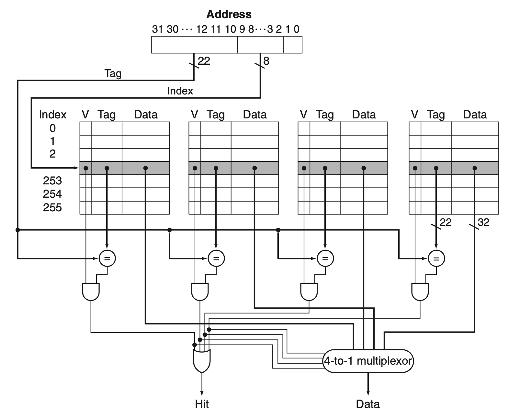
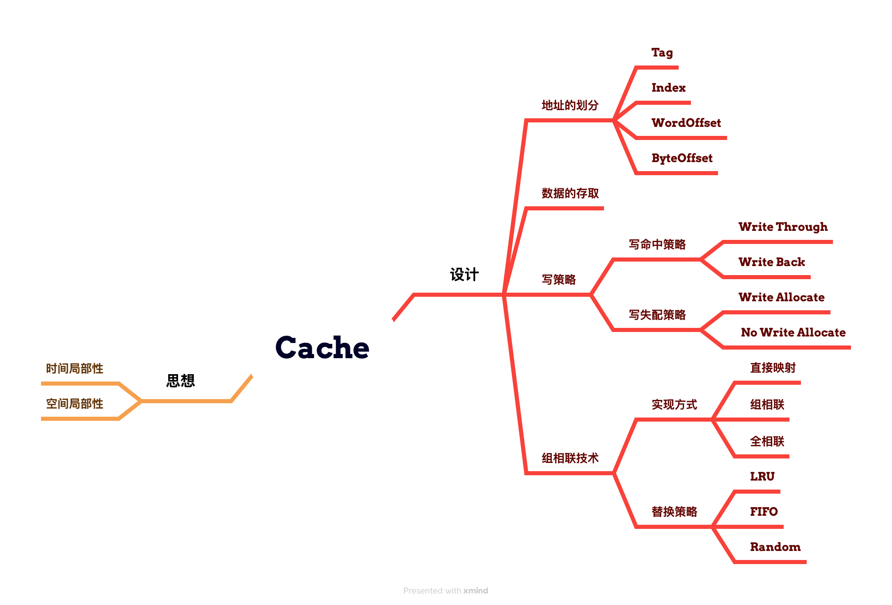
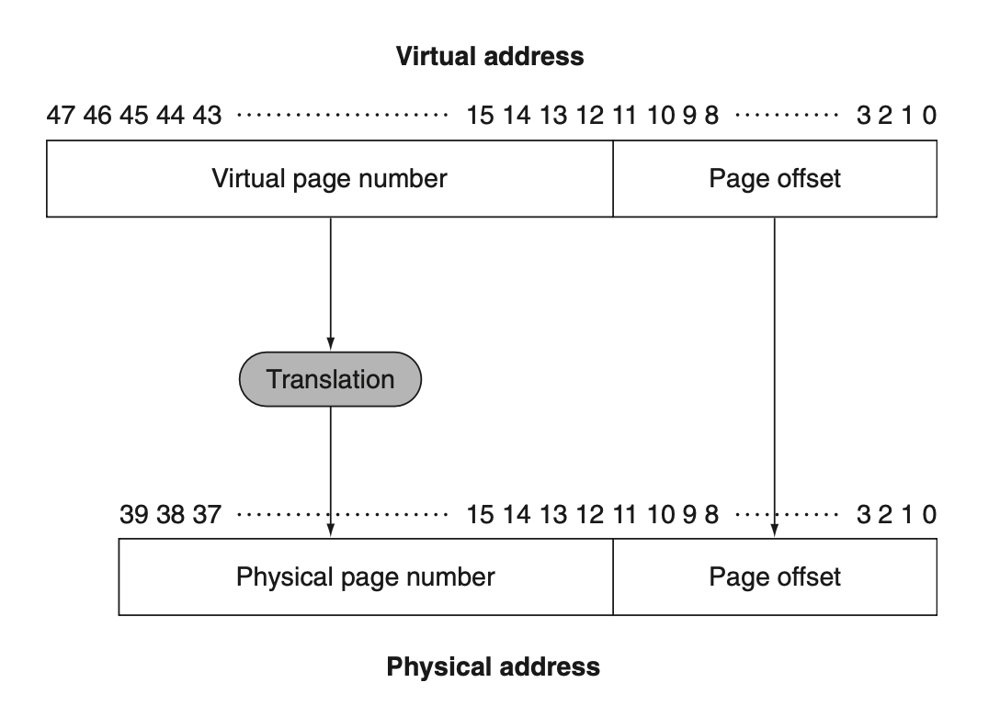
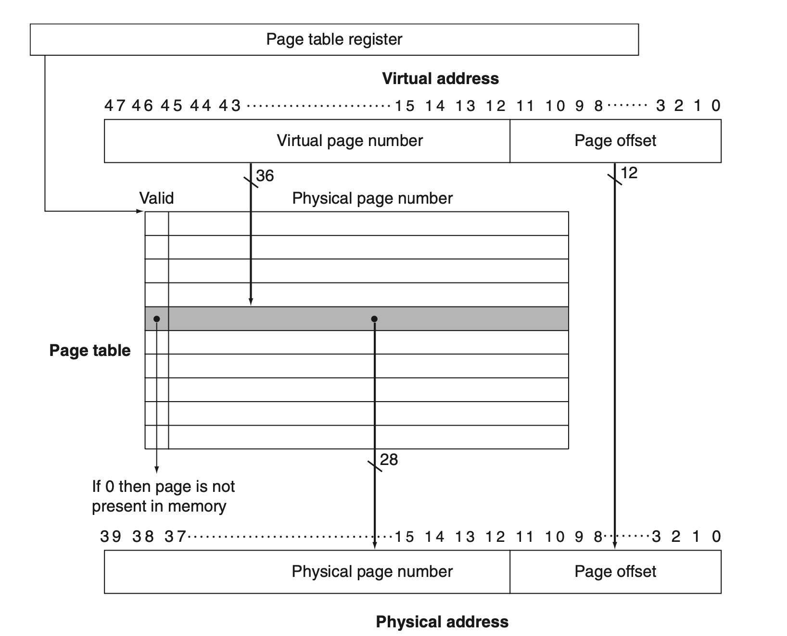
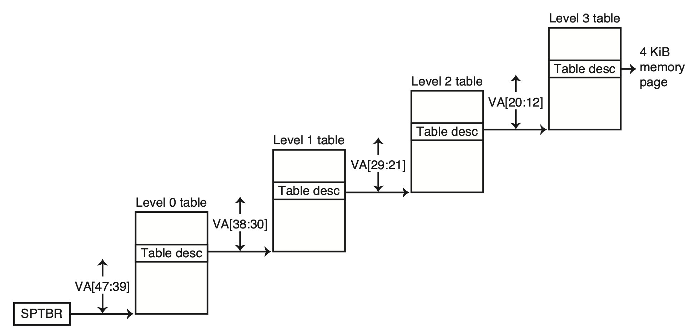
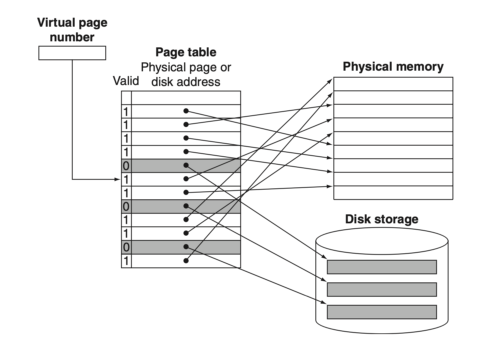
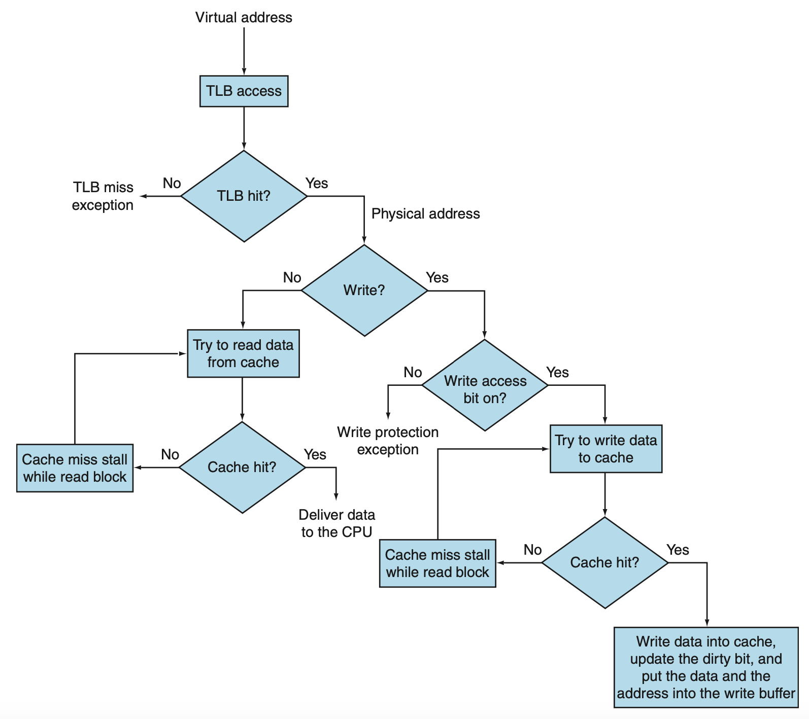

# Chapter 0：《计算机组成》复习

??? abstract "目录"
    - CPU 设计
        - 流水线 CPU
        - 中断与异常
    - 存储层次结构
        - Cache 相关知识
        - 虚拟内存
    - 实验 Tips

## CPU 设计

### 流水线 CPU

**问题一：为什么需要流水线？**

答：增大 CPU 的吞吐量，提高 CPU 的效率。

**问题二：流水线 CPU 能够运行的硬件前提是什么？**

答：我们能够把硬件划分为多个阶段，每个阶段的硬件是独立的（同一时间内不会有结构冲突）。

### RISC-V 简单五级流水线

- **IF**：Instruction Fetch
- **ID**：Instruction Decode
- **EX**：Execute
- **MEM**：Memory Access
- **WB**：Write Back

为了在下一阶段的指令执行中能够用到上一阶段的结果，需要保存上一阶段的结果，于是引入流水线寄存器。

### 流水线寄存器

- **IF/ID**：存储从指令存储器读取的指令**等**
- **ID/EX**：存储从寄存器堆读取的寄存器值**等**
- **EX/MEM**：存储 ALU 的计算结果**等**
- **MEM/WB**：存储从数据存储器读取的数据**等**

每条指令有一套自己的硬件控制信号。单周期 CPU 中，由于一次只执行一条指令，因此只需要一套控制信号。

而流水线 CPU 中如果控制信号不做存储，则后面指令的控制信号会覆盖前面指令的控制信号，导致错误执行。所以控制信号也要随着流水线向前推进。

### 解决冲突

- **结构冲突**：多个指令需要访问同一硬件资源
    - 这里主要考虑寄存器堆的访问，使用下降沿写入，上升沿读取的方式解决
- **数据冲突**：后面的指令需要用到前面指令的结果
    - 有 EX 冲突，MEM 冲突；MEM 冲突还分为数据是 ALU 计算结果还是访存结果
    - 可以通过无脑 stall 解决，但是会严重影响性能
    - 也可以通过 forwarding 解决，但是需要额外的硬件支持
    - load-use 类型冲突不能直接 forwarding，需要先 stall 一拍
- **控制冲突**：分支指令的执行结果会影响后面指令的执行
    - 可以直接 stall 直到能够判定出分支结果
    - 也可以使用分支预测技术，常用的静态预测方式是预测不跳转（为什么？）
    - 静态预测可以提前到 ID 阶段
    - 动态预测也有很多种，比如一位、两位预测、锦标赛预测等

### 中断与异常

这里要区分一下：

- **Exceptions**：程序运行过程中的异常事件，如除零、内存访问越界等。
- **Interrupts**：外部事件引起的中断，如 I/O 设备的输入输出。

??? important "区分中断和异常"
    一种角度：异常一般是同步的，而中断**一般**是异步的。

    另一种角度：异常是由程序引起的，而中断**一般**是由外部设备引起的。

在实验（Lab2）中，异常会以非法指令、`ecall` 等形式出现，而中断会以外设中断等形式出现。

下文不区分异常和中断，统称为异常。

### 遇到了异常怎么做？

统共分三步：

- 保留案发现场
- 跳到异常处理程序
- 处理完异常后恢复现场，继续执行

!!! tip "两个问题"
    - **用户程序没法直接访问异常处理程序，怎么办？**
        - 答案：通过区分不同的特权级别，异常处理中在不同的特权级别之间切换。
    - **如何保留现场？**
        - 答案：引入 CSR 寄存器来保存 CPU 的状态。

### RISC-V 特权级别

阅读**官方的**、**最新的** RISC-V 特权指令集手册是非常重要的。

| Level | Abbreviation | Description |
| --- | --- | --- |
| 0 | U | User Mode |
| 1 | S | Supervisor Mode |
| 2 |  | Reserved |
| 3 | M | Machine Mode |

==所有硬件实现必须提供 M 模式。==

### CSR 寄存器

CSR 寄存器是一种特殊的寄存器，用于保存 CPU 的状态。CSR 寄存器的访问方式和普通寄存器不同：

- 只能在某些特权级别下访问。
- 只能用 CSR 指令访问。

RISC-V 提供了 4096 个 CSR 寄存器，用于保存 CPU 的状态。常见的 CSR 寄存器有：

- `mstatus`：保存 CPU 的状态，如中断使能、特权级别等。
- `mcause`：保存异常原因。
- `mepc`：保存异常发生时的 PC。

具体实现可以在实验中体会。

### 处理过程

- **Save the Context**：保存当前的 CPU 状态。这包括 PC、寄存器等。
    - 将当前 `PC` 保存到 `mepc` 
    - 发生异常的地址存入 `mtval`
    - 将中断/异常原因写入 `mcause` 寄存器
    - `mstatus.MPIE=mstatus.MIE`, `mstatus.MIE=0` 关闭中断使能
    - 进入机器态
- **Trap Handler**：跳转到异常处理程序。这个程序一般是预先定义好的，其起始地址放在 `mtvec` 寄存器中。
    - **Direct Mode**：直接跳转到中断处理程序。
    - **Vectored Mode**：通过中断号跳转到中断处理程序。
- **Return**：处理完异常后，恢复 CPU 状态，继续执行。
    - `mstatus.MIE=mstatus.MPIE` 恢复中断使能 
    - `PC` 跳转到 `mepc` 定义的地址处继续运行
    - 从机器态返回原来的态

## 存储层次结构

### 缓存的思想：局部性

你坐在图书馆的桌子前，正在进行一项需要查阅或修改某些书籍的工作。

你发现，每次你需要一本书时，你都要从书架上拿下来，翻开，找到你需要的那一页，然后再放回去。

这样的过程很慢，于是你决定在桌子上放一些书，这样你就不用每次都去书架上找了。

桌子上的容量有限，但是拿取速度快；书架上的容量大，但是拿取速度慢。

**选哪些书放在桌子上呢？** 你发现两个有趣的点：

- 你刚看完的书，有比较大概率下次还会用到。==（时间局部性）==
- 你看的书的同类型书（它们在书架上可能是相邻的），也有比较大概率下次会用到。==（空间局部性）==

于是你决定把这些书放在桌子上，这样你就可以更快地找到你需要的书了。

**以下，我们假定从书架上拿书不是“剪切”，而是“复制”。**

### 缓存的思想：映射

当你想要查看一本书的时候，你会获得一个位置信息，然后通过位置信息找到这本书。

怎样知道这本书在书架上的位置呢？这就需要你在拿取书的时候记下这本书在书架上的位置。

现在假设一共有 100 个书架，每个书架有 8 层，且每层只放一本书。你的桌子恰好也只能放 8 本书。

当你拿取一本书的时候，你会记下这本书在**第几个书架**==（Tag）==。

同时，如果这本书在第 i 层 ==（Index）==，你就把这本书放在桌子上的第 i 个位置。

如果第 i 个位置有书可以查阅，你就标记这个位置是有效的 ==（Valid）==。

如果桌子的第 i 个位置已经有书，现在你又要从书架上拿一本恰好也在第 i 个位置的书，那么你就需要把这个位置的书替换掉。==（块替换）==

### 缓存的思想：定位

如果用 <书架号, 层号> ==（Address）== 来表示这本书，那么当你收到一个 <书架号, 层号> 的请求时，你就可以很快地找到这本书：

- 先按层号，定位到你桌子上的第 i 本书的位置
    - 如果这个位置没有有效数据（不是 Valid），说明这个位置没有书，需要从书架上拿 ==（Miss）==
    - 如果有，还需要比对书架号
        - 如果不一样，说明这本书不在桌子上，需要从书架上拿 ==（Miss）==
        - 如果一样，说明这本书在桌子上，直接拿就行了 ==（Hit）==

### 缓存的思想：写策略

如果你想修改某本书的内容，当桌子上恰好有这本书 ==（Write Hit）== 时，有两种写策略：

- 修改桌子上的书，同时也修改书架上的书 ==（Write Through）==
    - 每次修改都要写回书架，这样保证了书架上的书和桌子上的书是一样的
    - 但是这样会增加写回的时间
- 只修改桌子上的书，等到替换时再修改书架上的书 ==（Write Back）==
    - 这种方法需要我们额外标记书的内容**自从上次放在桌子上之后是否被修改过** ==（Dirty）==
    - 如果在某一本书被替换的时候恰好是 dirty，需要先写回书架再替换
    - 如果不是 dirty，就直接丢掉，就需要写回书架，这样节省了写回的时间

如果桌子上没有这本书 ==（Write Miss）==，需要从书架上拿，这时候也有两种写策略：

- 直接在书架里面修改，不放在桌子上 ==（No Write Allocate）==
    - 一般和 Write Through 结合使用
- 先拿到这本书放在桌子上，再在桌子上修改 ==（Write Allocate）==
    - 一般和 Write Back 结合使用

### 缓存的思想：更大的 data 块

每一层只放一本书未免太浪费了，于是你决定每一层放四本书。这四本书的位置用两位的偏移量就能够表示。

那么现在想定位一本书，除了书架号和层号，还需要偏移量 ==（Byte Offset）==。于是你把前面提到的 address 修改为：

- <书架号, 层号, 偏移量> -> `| Tag | Index | Byte Offset |`

同时，你的桌子也要做相应的修改：每一次拿取和放回都是以层为单位，也就是一次拿取四本书。桌子的每个位置都可以摞起来四本书。

由于查阅还是以一本书为单位，所以在从位置信息获取到四本书后，你会再根据偏移量找到你需要的那本书。

然而由于四本书的顺序在任何时候都是固定的，所以你只需要在查找的最后一步利用偏移量即可，不需要做额外的比对和处理。

同样，需要注意的是，如果桌子上某个位置已经满了，你需要替换的时候，也是以层为单位的。

**以下，我们称一层的四本书为一个块，或者叫一捆。==（Block）==** 前面提到的所有有关“一本书”的操作都应该改为“一个块”。

### 缓存的思想：组相联

现在一切都 work 得比较好。然而没多久你发现你似乎花了很多时间在“替换”这件事情上，为什么？

这是因为你的桌子有 8 个位置，每个位置只能放一捆书。如果每个位置能放不止一捆呢？

这里我们假设桌子的容量是固定的。现在你想让每个位置能放两捆书，相应的，你需要把这 8 个位置两两配对合并，每一对称为一个组 ==（Set）==。

这样，你的桌子就被分为四对，每一对都有两个位置，称为路 ==（Way）==。

如果某一捆书的位置经过计算后发现它应该放在某一对的位置上，那么这一捆书就可以放在这两个位置中的任意一个（如果有空的话）。

同理，还可以把这 8 个位置分为两对，每一对有四个位置，称为四路组相联 ==（Four-way Set-Associative）==。

也可以把整个桌子看作一个整体，每一捆书是存放和替换的基本单位。这样的话只要有空位置就可以随便放，不需要考虑位置的具体信息，称为全相联 ==（Fully Associative）==。

同时，由于桌子从 8 个位置变为 4 组，位置信息也需要做相应的修改：

- <标识号, 序列号, 偏移量> -> `| Tag | Index | Byte Offset |`

我们要抛弃之前固定的书架和书架层视角，而把整个书架群看作一个存放书本的整体，每一捆书是存放和替换的基本单位。

!!! tip "想一想"
    把直接映射和现在的二路组相联的地址分布图画出来，看看有什么不同。你能总结出什么规律？如果是四路组相联呢？

??? note "变化规律"
    - 从直接映射到二路组相联，Index 减少一位，Tag 增加一位
    - 从二路组相联到四路组相联，Index 减少一位，Tag 增加一位
    - 全相联情况下，Index 为 0 位，全部“在 Tag 中”
    - Byte Offset 位数不变

### 缓存的思想：组相联查找

现在你想要查看一本书，你会获得一个位置信息：

- 先按序列号（index），定位到桌子上的第 i 组
    - 第 i 组中有 n 路，需要依次比对 n 个 Tag（因为同一组内的每一路都有可能存放这本书）
        - 如果有一路的 Tag 和你的标识号（Tag）一样，说明这本书在桌子上，直接拿就行了
        - 如果没有，说明这本书不在桌子上，需要从书架上拿

写策略与之前的思路类似，只是在替换的时候需要考虑组内的替换。

### 缓存的思想：组相联替换策略

在组相联情况下，我们的拿取和替换仍然是以捆（Block）为单位。

什么情况下需要替换？当桌子上某一组的 n 路都已经存放有书，并且准备向桌子上再在同一组放一本书的时候，就需要替换。

问题来了，我们应该替换哪一路的书呢？

- **随机替换**：随机选择一路替换 ==（Random）==
- **最近最少使用替换**：替换最近最少使用的一路 ==（LRU）==
- **先进先出替换**：替换最先进入的一路 ==（FIFO）==

### Cache 总结

## 虚拟内存

本部分内容在《计算机体系结构》课程中涉及较少，以下内容仅作简单介绍。详细内容会在《操作系统》课程中学习。

为了实现操作系统中进程的隔离和保护，以及提高内存利用率，引入了虚拟内存技术。

将主存视作二级存储（如磁盘）的“cache”。

* **Physical Address**：实际的物理内存地址。
* **Virtual Address**：进程中使用的地址、CPU 计算的地址，需要通过 MMU（Memory Management Unit）转换为物理地址。

虚拟内存的实现方式有很多种（分段、分页等），本课程重点介绍了基于分页的虚拟内存管理。

### 分页技术

将虚拟内存和物理内存划分为固定大小的块，称为页。

物理内存的一个 block 叫做帧（frame），虚拟内存的一个 block 叫做页（page）。两种 block 的大小相同。（课本上管物理 block 也叫 page，这里不纠结这个名字）

以 4KB 的页大小为例，按照字节寻址方式，一个页可以存储 $2^{12}$ 个字节，这便是 page offset（12 bits）。

### 页表

如何将虚拟地址映射到物理地址？使用页表。

页表中存储着物理地址的 frame number，通过虚拟地址的 page number 找到对应的 frame number。

块内偏移是一样的。

### Real Stuff in RISC-V

RISC-V 中使用四级页表来将 48 位的虚拟地址映射到 40 位的物理地址。详细内容会在操作系统课程中介绍。

### 缺页

如果数据不在主存中（页表中没有对应的 frame number），则会发生 page fault。

这时候需要从磁盘中将数据读入主存，然后更新页表。

将会引发巨大的性能开销，因此需要合理设计页表和缓存。

### 页替换

如果页表中的所有 page 都已经被占用，需要选择一个 victim page 替换。

一般选用 LRU（Least Recently Used）算法，即选择最久未被访问的 page 替换。

页的替换由操作系统来完成。

被替换的页如果是 dirty 的，需要写回磁盘，这会引发额外的开销。

### TLB

**T**ranslation **L**ookaside **B**uffer，用于加速虚拟地址到物理地址的转换。

可以看作是页表的缓存，存储了最近使用的虚拟地址到物理地址的映射。

拿到虚拟地址先去查 TLB，如果命中则直接得到物理地址，否则再去查页表。

## 实验 Tips

### 关于 Verilog 语言

- 要记住 Verilog 是一种硬件描述语言，不是一种编程语言。
- 做任何模块的时候，都强烈建议先画图，搞清楚输入输出关系。
- 推荐练习网站：[HDLBits](https://hdlbits.01xz.net/wiki/Main_Page)

### 关于 Vivado 使用

- 多问：
    - 问 TA
    - 问同学
- 可以课后找我
- 学会自己写仿真文件，做有针对性的测试

### 关于实验

- 一定要先通读一遍实验框架，搞清楚模块与模块之间的关系
- 不同的班级在实验安排上有区别，同一个实验在不同班级的验收方式也不尽相同
    - 以自己班级的 TA 要求为准
- 先画图，再写代码
- [Venus 平台](https://venus.cs61c.org/)可以用来调试 RISC-V 汇编代码

### Lab 2 的一些提示

- 几个模块之间的关系
    - `[     [     [CSRRegs]       ExceptionUnit      ]       RV32Core    ]`
- `ExceptionUnit` 
    - 能够接收 ID 阶段提供的 CSR 寄存器读写相关的控制信号
    - 为 `RV32Core` 提供异常处理支持，能够输出流水线寄存器的控制信号、异常处理 PC 地址
    - 内部维护了 `CSRRegs` 模块，用于保存 CPU 的状态
- `CSRRegs`
    - 基本编写方式与数据通路中的寄存器堆类似
    - 接收来自 `ExceptionUnit` 的控制信号，能够读写 CSR 寄存器
    - 能够为 `ExceptionUnit` 提供当前的 CPU 状态，也即输出实验规定的几个 CSR 寄存器的值
