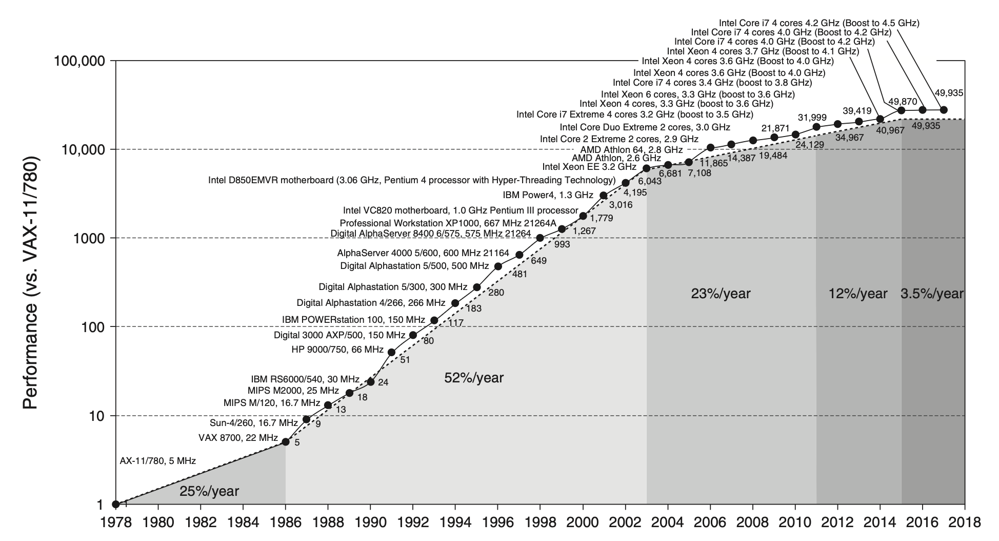
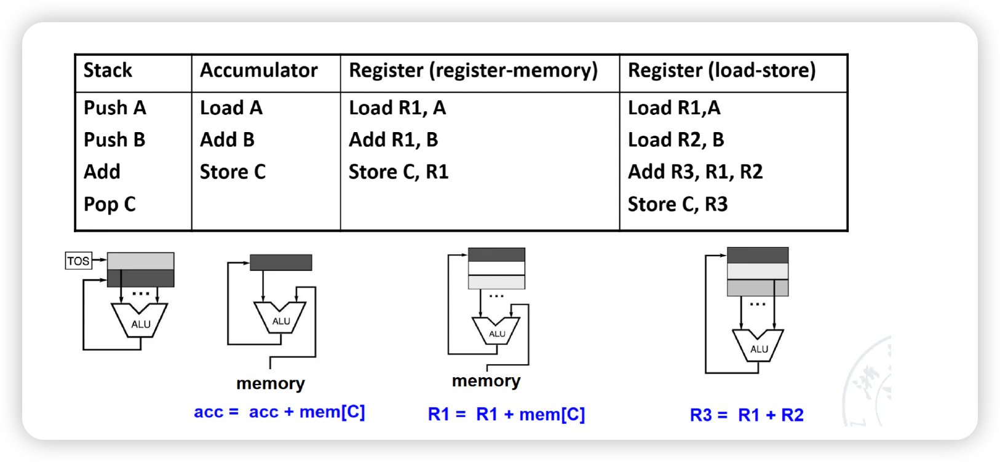
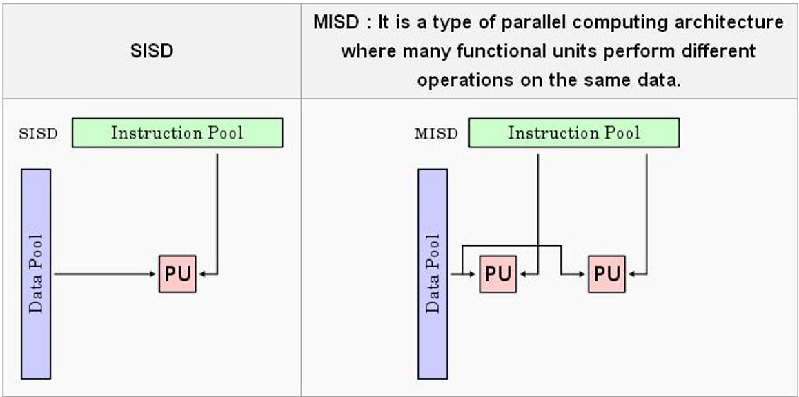
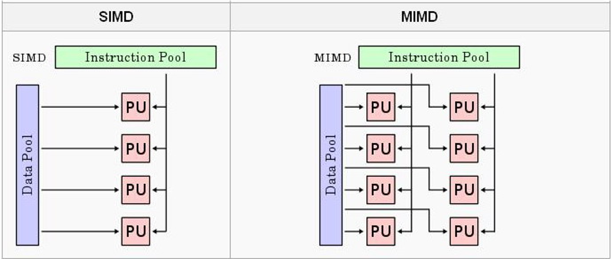
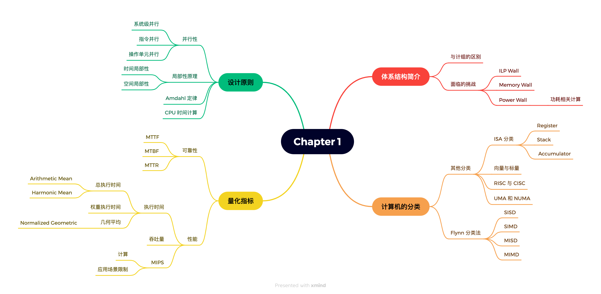

# Chapter 1：体系结构概述与性能量化

??? abstract "目录"
    - 前言：体系结构课与组成课
    - 体系结构的研究内容
    - 计算机性能量化方法

## 前言：体系结构课与组成课

### 重合度

- 我猜你前几节课在摸鱼
    - 体系结构前几节课和组成课后几节课的重合度较高
    - 体现在
        - 流水线 CPU 设计
        - 层次化存储
        - 性能量化方法
    - 刚才我们已经复习过，如有问题请提出
    - 如果你的组成课学的比较好，前期会轻松许多

### 体系结构课程内容

- Chapter 1
    - 体系结构概述
    - ~~计算机性能量化指标~~
    - 更高级的性能优化技术
- Chapter 2
    - ~~层次化存储简介~~
    - 更高级的存储优化技术
- Chapter 3
- Chapter 4
- Chapter 5

### 区别

- 体系结构从程序员的角度出发
    - 优化程序性能
    - 了解计算机硬件如何执行程序
    - 处于较高的抽象层次，多从逻辑和功能出发
- 组成课从硬件工程师的角度出发  
    - 实现体系结构的技术手段
    - 系统的物理实现
    - 处于较低的抽象层次，多从电路和器件出发

## 体系结构的研究内容

### 体系结构的定义

> The attributes of a [computing] system as seen by the **programmer**, i.e., the conceptual structure and functional behavior, as distinct from the organization of the data flows and controls the logic design, and the physical implementation.(Amdahl, Blaaw, and Brooks, 1964)

简要来说，体系结构是程序员看到的计算机系统的属性，包括概念结构和功能行为，而区别于数据流和控制逻辑设计以及物理实现。

### ISA 的设计：七个维度

- Class of ISA
- Memory Addressing
- Addressing Modes
- Tyoes and Size of Operands
- Operations
- Control Flow instructions
- Encoding an ISA

### 发展趋势

2004 年后，CPU 性能提升的速度放缓，主要原因有：

- 技术问题
    - 功耗、散热、物理限制
    - 晶体管的成本和功耗
- 体系结构设计问题
    - 单处理器时代，ILP 的极限
    - 受 Amdahl 定律限制，“简单”多核处理器并不一定能提升性能
- 应用领域转变
    - 从桌面应用到移动应用、云计算等

### 三堵“墙”

- ILP 墙
    - 探寻更多的指令级并行性
    - 会在第三章详细讨论
- 内存墙
    - CPU 与内存之间速度的不匹配
    - Memory 变成了瓶颈
- 功耗墙
    - 电力成本的增加
    - 散热问题

### 计算机的种类

- 量子计算机 vs. 化学计算机
- **标量处理器 vs. 向量处理器**(后面会学到)
- **统一内存（UMA） vs. 非统一内存（NUMA）**（后面会学到）
- **Register Machine vs. Stack Machine vs. Accumulator Machine**
    - 曾出现在 23 秋冬期末考试卷中（原题缺失）
- **RISC vs. CISC**
- 类脑芯片 vs. 冯诺依曼架构
- 蜂窝结构

### ISA 分类

- 寄存器型
    - 拥有显式的操作数
    - 有两种
        - 寄存器-内存型，如 x86：操作数可以是寄存器或内存
        - 寄存器-寄存器型，如 MIPS：操作数只能是寄存器，仅有 load/store 指令才可以访问内存
- 堆栈型
    - 隐式操作数，操作数在栈顶
    - 操作数从栈中弹出，结果压入栈中
- 累加器型
    - 有一个临时的累加器，操作数放在累加器里面进行运算

以 A+B 为例：

### 计算机的种类：Flynn 分类

- SISD：Single Instruction, Single Data
    - 单处理器
- SIMD：Single Instruction, Multiple Data
    - 会在第四章详细讨论
- MISD：Multiple Instruction, Single Data
    - 没有实际应用
- MIMD：Multiple Instruction, Multiple Data

### 关于功耗

两个概念：

- Dynamic Power：切换晶体管的功耗
    - $\text{Power}_{\text{dynamic}} = \frac{1}{2} \times \text{Capacitive load} \times \text{Voltage}^2 \times \text{Frequency Swicthed}$
    - $\text{Energy}_{\text{dynamic}} = \text{Capacitive load} \times \text{Voltage}^2$
- Static Power：静态功耗
    - $\text{Power}_{\text{static}} = \text{Current static} \times \text{Voltage}$

一个经验法则：

- 电压降低 10%，功耗降低 30%，性能降低不到 10%

### 可靠性

- MTTF：Mean Time To Failure
- MTTR：Mean Time To Repair
- MTBF：Mean Time Between Failure
    - MTBF = MTTF + MTTR
- Availability = $\frac{\text{MTTF}}{\text{MTTF + MTTR}}$

???+ important "Example"
    A system consists of the following components:

    - 10 disks, 1000000 hour MTTF
    - 1 SCSI controller, 500000 hour MTTF
    - 1 power supply, 1 fan, both 200000 hour MTTF
    - 1 SCSI cable, 1000000 hour MTTF

    What is the MTTF of the system?

    ??? note "参考答案"
        **Answer**:

        - Failure rate of the system = $\frac{1}{\text{MTTF}} = 10 \times \frac{1}{1000000} + \frac{1}{500000} + 2 \times \frac{1}{200000} + \frac{1}{1000000}$
        - MTTF = $43500$ hours ~ 5 years

???+ important "Example"
    In a server farm such as that used by Amazon or eBay, a single failure does notcause the entire system to crash. Instead, it will reduce the number of requeststhat can be satisfied at any one time. If a company has 10,000 computers, eachwith a MTTF of 30 days, and it experiences catastrophic failure only if 1/3 of thecomputers fail, what is the MTTF for the system?

    ??? note "参考答案"
        **Answer**:

        - 电脑每天故障的概率为 $\frac{1}{30}$
        - 每天故障的电脑数量为 $10000 \times \frac{1}{30}$
        - 总共 $10000$ 台电脑，当有 $10000 \times \frac{1}{3}$ 台电脑故障时，系统发生故障
        - 崩溃天数为 $\frac{10000 \times \frac{1}{3}}{10000 \times \frac{1}{30}} = 10$ 天

## 计算机性能量化方法

- 执行时间
- 吞吐量
- MIPS：Million Instructions Per Second，每秒百万条指令
    - $\text{MIPS} = \frac{\frac{\text{\# of instructions}}{\text{benchmark}} \times \frac{\text{benchmark}}{\text{total run time}}}{1000000}$
    - 需要注意的是，使用同样的 ISA 比较两个机器，MIPS 是一个有效的比较指标
    - 但是，不同的 ISA 之间的比较是不合适的，这时候 MIPS 就不适用了

### 执行时间

课程介绍了三种性能计算方式：

- 总执行时间
    - 具有统一的结果
    - 有表达方式之分：arithmic mean 和 harmonic mean
        - Arithmetic Mean：$\text{AM} = \frac{1}{n} \sum_{i=1}^{n} \text{Time}_i$
        - Harmonic Mean：$\text{HM} = \frac{n}{\sum_{i=1}^{n} \frac{1}{\text{Rate}_i}}$
    - 但是测试的程序在实际应用中的 workload 不一定是真实的
- 带有权重的执行时间 Weighted Execution Time
    - $\text{WET} = \sum_{i=1}^{n} \text{Weight}_i \times \text{Time}_i$
    - Weighted Harmonic Mean：$\text{WHM} = \frac{n}{\sum_{i=1}^{n} \frac{\text{Weight}_i}{\text{Rate}_i}}$

- 几何平均值 Geometric Mean
    - $\text{GM} = \sqrt[n]{\prod_{i=1}^{n} \text{Relative\_Rate}_i}$，具有性质：$\frac{\text{GM}(X_i)}{\text{GM}(Y_i)} = \text{GM}(\frac{X_i}{Y_i})$
    - Normalized Geometric Mean 具有统一的结果，无论参考机器是什么

???+ important "Example"
    **(24 秋冬期末考试)** Which one of the following performances generates consistent result, no matter which machine is the reference?

    A. arithmetic mean

    B. weighted arithmetic mean

    C. normalized geometric mean

    D. harmonic mean

    ??? note "参考答案"
        **Answer**: C

### 量化分析与设计原则

- 利用好并行性
- 局部性原理
- 重点关注常见情况 Focus on the common case
- Amdahl 定律
- CPU 性能计算公式

### 并行性

- 系统级别：多处理器
- 指令级别：流水线等
- 操作单元级别：组关联缓存、流水化功能器件等

### 局部性原理

- 时间局部性：刚被访问的数据很可能马上会被再次访问
- 空间局部性：刚被访问的数据附近的数据很可能马上会被访问

经验法则：90-10 法则：程序的 90% 的执行时间花费在 10% 的代码上

### Amdahl 定律

==Simple is fast==

Amdahl 定律可以用来解释这个原则：

$$
\text{Speedup} = \frac{1}{(1 - f) + \frac{f}{s}}
$$

其中 $f$ 为性能提升的部分占比，$s$ 为提升的比例。

???+ important "Example"
    Suppose we made the following measurements:

    - Frequency of FP operations = 25%
    - Average CPI of FP operations = 4.0
    - Average CPI of other instructions = 1.33
    - Frequency of FSQRT = 2%
    - CPI of FSQRT = 20

    Assume that the two design alternatives are to decrease the CPI of FSQRT to 1.5, or to decrease the average CPI of all FP operations to 2. Compare these two design alternatives using the processor performance equation.

    ??? note "参考答案"
        **Answer**:

        - 第一种：0.02 × 1.5 +（0.25 - 0.02）× 4+（1 - 0.25）× 1.33
        - 第二种：0.25 × 2 +（1 - 0.25）× 1.33

### CPU 性能计算公式

* **CPU Time**
    * $\text{CPU Time} = \text{CPU Clock Cycles} \times \text{Clock Cycle Time} = \frac{\text{CPU Clock Cycles}}{\text{Clock Rate}}$

* **CPI**: ==Cycle Per Instruction==
    * $\text{CPI} = \frac{\text{CPU Clock Cycles}}{\text{Instructions}}$
    * $\text{CPU Time} = \text{CPI} \times \text{Instruction Count} \times \text{Clock Cycle Time}$

## 总结一下

