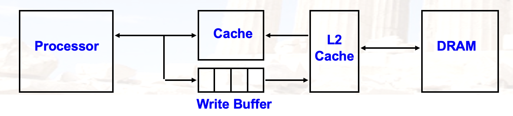
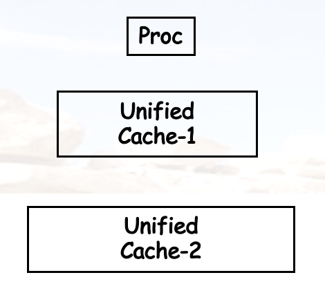
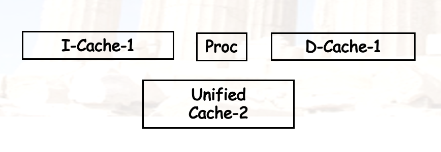
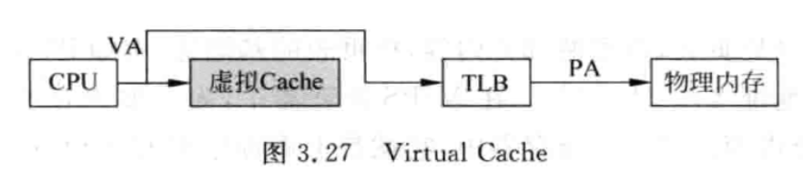
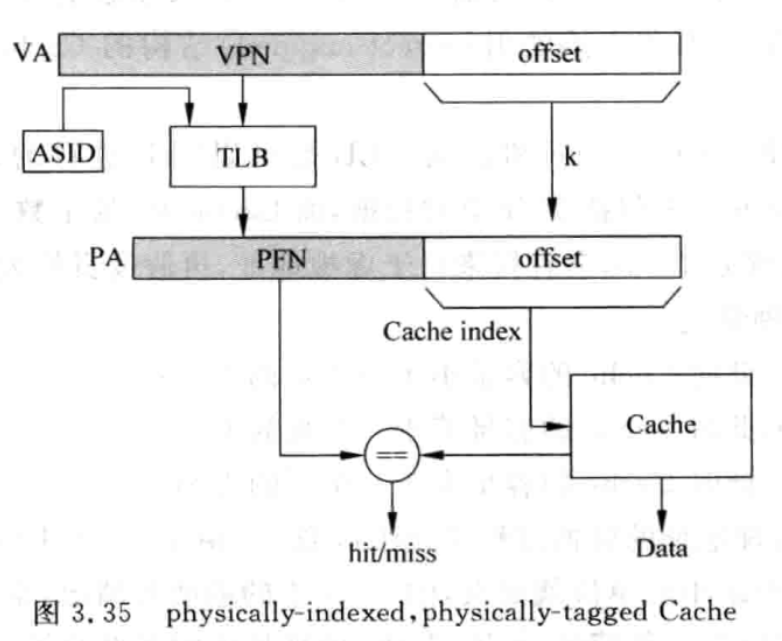
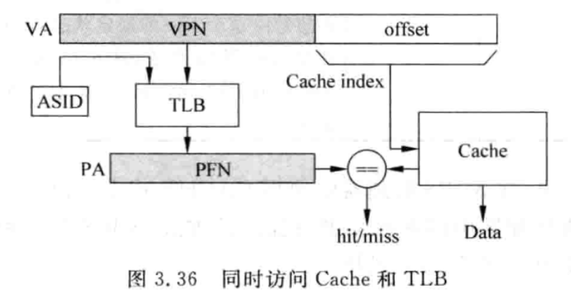
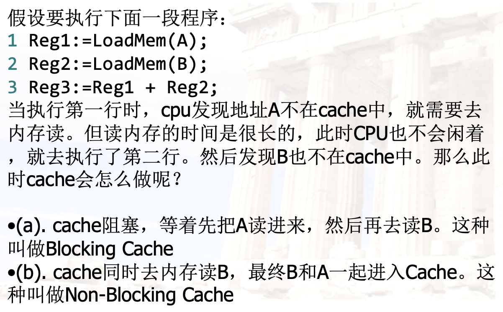
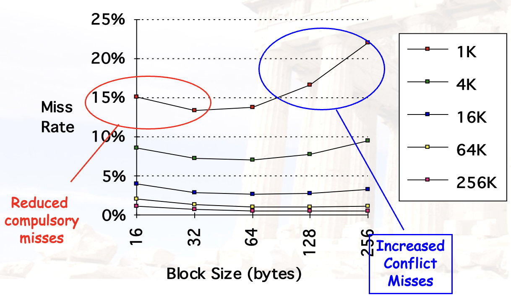
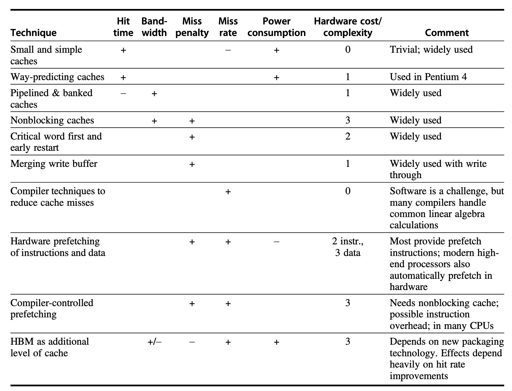

# Chapter 2：层次化存储

??? abstract "目录"
    - 几个概念补充
    - 存储技术
    - 缓存性能优化

## 几个概念补充

### Write Stall 与 Write Buffer

运行过程中不可避免会访问内存，即便使用了缓存，在某些情况下还是会发生写回内存的情况。这时候就会出现 Write Stall，即 CPU 等待写回内存的时间。

为了减少 write stall，引入了一种叫写缓冲区的组件：

- 一个临时保存待写入主存的 cache
- 也不能完全避免掉 write stall，毕竟 buffer 的大小是有限的

### Write Buffer 的工作原理

引入二级缓存后：

### 统一缓存与分离缓存

**Unified Cache**:

- 指令和数据共用一个 cache
- 更少的硬件，更低的命中率

**Split Cache**:

- 指令和数据分开存储
- 一般是一级缓存分开，二级缓存统一

### 缓存缺失的分类：3C

- **Compulsory Misses**: 冷启动 miss，第一次访问数据时发生的缺失
- **Capacity Misses**: 容量 miss，缓存容量不足导致的缺失
- **Conflict Misses**: 冲突 miss，多个数据映射到同一个缓存块导致的缺失

### AMAT：平均存储访问时间

$$
\text{AMAT} = \text{Hit Time} + \text{Miss Rate} \times \text{Miss Penalty}
$$

???+ important "Example 1"
    - Suppose a processor executes at
        - Clock Rate = 200 MHz(5 ns per cycle), Ideal(no misses) CPI = 1.1
        - 50% arith/logic, 30% ld/st, 20% ctrl
    - Suppose that 10% of memory operations get 50 cycle miss penalty.
    - Suppose that 1% of instructions get same miss penalty.

    **Calculate the AMAT and real CPI.**

    ??? note "参考答案"
        **Answer:**

        - AMAT = (1/1.3)x[1.1+0.01x50]+(0.3/1.3)x[1.1+0.1x50] = 2.54
        - CPI = ideal CPI + average stalls per instruction
            - = 1.1 + [0.3 x 0.1 x 50] + 1 x 0.01 x 50 = 3.1

## 存储技术

### SRAM 与 DRAM

- SRAM
    - 延时更低
    - 需要低电量来维护存储信息
    - 常用作 cache
- DRAM
    - 延时比 SRAM 高
    - 需要定期刷新
    - 地址线是复用的：上半部分为行，下半部分为列
    - 把 DRAM 以 bank 的形式组织成主存

### 存储性能提升

- Multiple access to same row
- SDRAM: **Synchronous** DRAM
- Wider interfaces
- DDR: **D**ouble **D**ata **R**ate
- Multiple banks on each DRAM device

## 缓存性能优化

### 缓存性能优化：基础版

- **Larger block size / 更大的缓存单元块容量**
    - Reduces compulsory misses
    - Increases capacity and conflict misses, increases miss penalty
- **Larger total cache capacity to reduce miss rate / 更大的缓存总容量**
    - Increases hit time, increases power consumption
- **Higher associativity / 更高级别的组相联**
    - Reduces conflict misses
    - Increases hit time, increases power consumption
- **Higher number of cache levels / 更多级别缓存**
    - Reduces overall memory access time
- **Giving priority to read misses over writes / 优先处理读缺失**
    - Reduces miss penalty
- **Avoiding address translation in cache indexing / 避免地址转换**
    - Reduces hit time

### 缓存性能优化：进阶版

***请务必抄在你的 A4 纸上***

### 一、降低命中时间

**1. Small and Simple Caches**：小而简单的缓存

- 硬件少，自然访问过程就快
- 直接映射的命中时间比组相联更快
- 把 cache 与 CPU 芯片结合在一起是更好的选择

**2. Way Prediction**：路预测

- 组相联的时候，采用预测器来预测数据所在的路
- 如果预测错误，会增加命中时间
- 预测正确率
    - \> 90% for two-way, \> 80% for four-way
    - I-cache has better accuracy than D-cache

**3. Avoiding Address Translation**：避免地址转换

- TLB
- 三种 cache 的地址转换方式
    - PIPT: Physically Indexed, Physically Tagged
    - VIVT: Virtually Indexed, Virtually Tagged（或者就直接叫 Virtual Cache）
    - VIPT: Virtually Indexed, Physically Tagged

### Cache 架构

*以下内容整理于文章：[知乎：关于Cache的歧义/别名问题和VIVT/VIPT/PIPT架构](https://zhuanlan.zhihu.com/p/577138649)*

**(1) VIVT**

- 实现较为简单
- 存在两大问题
    - 歧义 ambiguity：两个进程使用**相同的 virtual tag** 对应到**不同的 physical tag**，可以通过 **flush** 解决
    - 别名 aliasing：两个进程使用**不同的 virtual tag** 对应到**相同的 physical tag**

**(2) PIPT**

- 由于物理地址唯一，没有歧义与别名问题
- 无论命中与否，都会经过 TLB 或者页表转换，增加了访问时间

**(3) VIPT**

- 使用虚拟地址的一部分作为 index，使用物理地址的一部分作为 tag
- TLB 翻译得到 PFN 和 index 索引 Cache 是同时进行的
- 想要解决歧义别名问题，只需使得 $\text{index+offset} \leq \text{page offset}$(直接映射)，也可以通过增加组相联度来解决

**4. Trace Cache**：跟踪缓存

- 根据 CPU 的实际执行情况来设计 cache
- 对于指令缓存，可以动态跟踪指令的执行序列（包括分支情况）放入 cache
    - 指令流出流水线的时候，把指令段打包成 trace 放入 cache
    - 由于局部性原理，大部分分支预测是正确的

### 二、增大带宽

**1. Pipelined Caches**：流水线缓存

- 把缓存访问的过程流水化，提高吞吐量
- 但是会增加分支预测错误的惩罚

**2. Multibanked Caches**：多 bank 缓存

- 把缓存划分为独立的 bank，以支持**顺序访问**
- 当访问序列恰好按照 bank 数量展开的时候，可以提高带宽

**3. Nonblocking Caches**：非阻塞缓存

- Hit under (multiple) miss
- 一个 cache line 可以同时处理多个请求
- 与乱序执行相结合，能让 CPU 在 cache miss 之后还能接着执行

### 三、减少缺失开销

**1. Multilevel Caches**：多级缓存

> "All problems in computer science can be solved by another level of indirection." - David Wheeler

- 一级缓存可以减少 hit time，二级缓存可以减少 miss penalty
- 一级缓存的 miss penalty 就是二级缓存的 AMAT
- 区分两个概念
    - **Local Miss Rate**: 本级缓存缺失量 / **本级**缓存访问量
    - **Global Miss Rate**: 本级缓存缺失量 / **CPU** 访问量

**2. Giving Priority to Read Misses over Writes**：优先处理读缺失

- 如果有 write buffer，则可以暂缓处理写缺失，优先处理读缺失
- 但是处理读缺失的时候**要检查写缓冲区**，确保数据的一致性

**3. Critical Word First & Early Restart**：关键字优先 & 提前重启

- 不需要等到一个 block 都从 cache 取完之后再执行
    - 优先取出关键字，而不是整个 block
    - 也被称为 wrapped fetch 或 requested word first
- 需要的 word 取好之后就可以开始执行了
    - 这被称为 early restart

**4. Merging Write Buffer**：合并写缓冲区

- Write miss 的时候，如果恰好写的地址在写缓冲区里，可以合并写操作
- 一定程度上可以缓解写缓冲区满而造成的 stall

**5. Victim Caches**：牺牲缓存

- 一个容量较小的全相联缓存
- 原缓存块被替换的时候，会把这个块放入 victim cache
- 如果下次访问的时候发现在 victim cache 里，就可以减少 miss penalty

### 四、减少缺失率

回顾缺失的 3C 分类：

- **Compulsory Misses**: 冷启动 miss，第一次访问数据时发生的缺失
- **Capacity Misses**: 容量 miss，缓存容量不足导致的缺失
- **Conflict Misses**: 冲突 miss，多个数据映射到同一个缓存块导致的缺失

再加一个：

- **Coherence Misses**: 一致性 miss，多个 cache 之间的一致性问题导致的缺失（在第五章会讲）

三个变量：

- **Block Size**：缓存块大小
- **Cache Size**：缓存容量
- **Associativity**：组相联度

以下，我们固定其他两个变量，讨论如何优化第三个变量。

**1. Larger Block Size**：更大的缓存块

- 利用空间局部性，**减小 compulsory misses**
- 由于更大的缓存块需要存取，增加了 miss penalty
- 会**增加 conflict misses**，甚至可能导致 capacity misses

**2. Larger Cache Size**：更大的缓存容量

- 能够**减小 capacity misses**
- 代价是更长的 hit time、更高的成本

**3. Higher Associativity**：更高级别的组相联

- 能够**减小 conflict misses**
- 经验法则：大小为 N 的直接映射 cache 的 miss rate 大约等于大小为 N/2 的两路组相联 cache 的 miss rate
- *需要注意的是，不同的相联度可能会影响 clock cycle time，进而影响整体性能*

**4. Compiler Optimizations**：编译器优化

不做其他的硬件优化，只通过编译器优化来减少缺失率：

- 指令级别：
    - 重排指令、冲突分析
- 数据级别：
    - Merging Arrays 数组合并
    - Loop Interchange 循环交换
    - Loop Fusion 循环融合
    - Blocking 数据块化

**5. Way Prediction & Pseudo-Associative**：路预测与伪相联

### 五、通过并行减少缺失率或缺失开销

**1. Hardware Prefetching**：硬件预取

- 在真正用到之前，提前把数据或指令放入 cache
- **减少 compulsory misses**
- 由于可能会把有用的 blocks 挤出 cache，也许会增加其他的 miss
    - 所以许多 cache 有一个 prefetch buffer

**2. Compiler-controlled Prefetch**：编译器控制的预取

- 编译器插入预取指令
- 需要在预取的开销与其获得的性能提升之间取得平衡

## 总结一下

