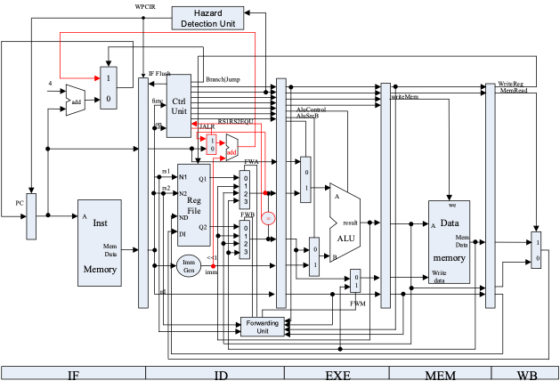
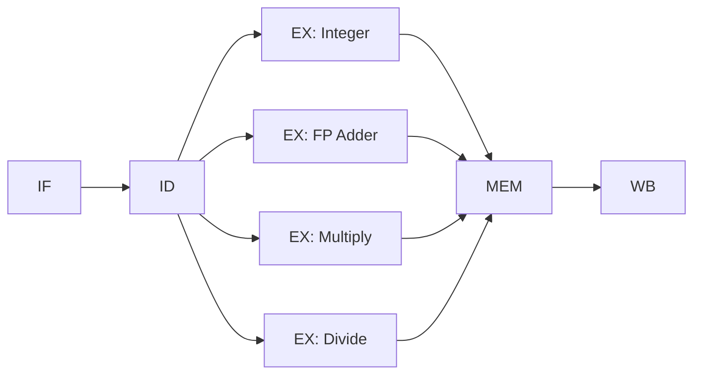
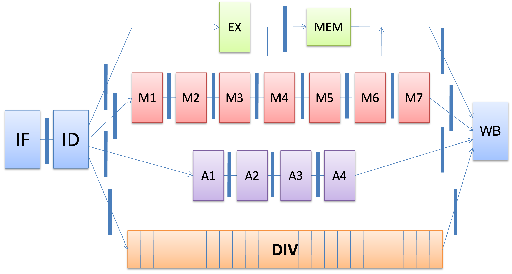

# Chapter 3-1：ILP 与 Scoreboard 算法

??? abstract "目录"
    - 准备工作：基础流水线的功能拓展
    - 核心知识：ILP 概念及手段
        - 硬件方法
            - 动态调度
                - Scoreboard 算法

## 基础流水线的功能拓展

### 回顾以前的流水线 CPU



### 功能拓展

为了引入 FP 计算功能（包含浮点加减法、浮点/整数乘除法等），我们选择修改流水线中的 EX 阶段，引入更多的 FU（Function Units），也即：



### FU 的计算延迟

由于不同 FU 操作时间不同，引入两个概念：

- **Latency**: 【上一个指令产生结果】与【下一个指令使用结果】之间的时间间隔
    - Latency = (FU Time - 1) cc.
- **Initiation interval**: 两条指令发射入同一个 FU 之间，必须至少间隔多少个时钟周期
    - 如果该 FU **完全流水化（Fully Pipelined）**，那么 initiation interval 就是 1
    - 如果该 FU **非流水化（Non Pipelined，或者叫完全非流水化）**，那么 initiation interval 就是 \[latency + 1\]

例如：

| **FU** | **Latency** | **Initiation Interval** |
|---|-------|------------------|
|Integer ALU | 0 | 1 |
|Data Mem(Int. & FP Loads) | 1 | 1 |
|FP Adder | 3 | 1 |
|FP Mult.(also Int.) | 6 | 1 |
|FP Div.(also Int.) | 24 | 25 |

对应着以下的示意图：



### 存在的问题

- 需要添加新的流水线寄存器
- 由于除法器是非流水化的，有可能发生结构冲突
- 由于指令执行时间不同
    - 可能发生同一个周期内多条指令同时写回寄存器的问题
    - 可能发生写寄存器顺序错乱问题：WAW 数据冲突
- 由于某些操作执行时间较长，RAW 冲突造成的停顿会更多
- 由于乱序完成，精确中断可能是一个问题

!!! info "想一想"
    会存在 WAR 冲突吗？

### 数据冲突的分类

- **RAW**: Read After Write，读操作在写操作之后
    - 例如：`R1 = R2 + R3; R4 = R1 + R5;`
    - 被称为 true dependency，也就是只有 RAW 才是真正的数据依赖，且不能消除
- **WAR**: Write After Read，写操作在读操作之前
    - 例如：`R1 = R2 + R3; R2 = R4 + R5;`，如果第二条指令在第一条指令读寄存器之前完成，`R2` 的值错误
    - 被称为 anti dependency，可以通过寄存器重命名解决，所以也叫 naming dependency
- **WAW**: Write After Write，两个错误的写操作顺序
    - 例如：`R1 = R2 * R3; R1 = R4 + R5;`，由于乘法更慢，有可能后完成，`R1` 的最终值错误
    - 被称为 output dependency，也可以通过寄存器重命名解决，也是一种 naming dependency

### 解决上述问题

- **解决结构冲突**
    - 每个 FU 设置一个 busy 位，开始执行设置为 1，结束执行设置为 0
    - 需要注意：不同 FU 的流水化程度不同
- **解决同时写回冲突**
    - 设计移位寄存器。如果当前开始执行的指令要在 N 个周期后写回，则将预约寄存器的第 N 位置位。每个时钟周期，预约寄存器整体左移。这样就可判断当前 M 个周期后是否有指令需要写回
- **解决 WAW 冲突**
    - 记录每个 FU 将会写回到什么位置，同时利用预约寄存器判断目前 FU 将会在多久以后写回，这样只需要等待，直至当前指令在其之后写回。
- **解决 RAW 冲突**
    - 记录每个 FU 将会写回到什么位置，同时利用 busy 来判断该 FU 是否仍然未完成执行。如果未完成，等待直到结果已经写回。

## ILP 简介

### ILP

Instruction Level Parallelism，指令级并行

- 试图寻找【指令之间能够 overlap 执行】的机会
- 目标是尽可能减小 CPI（Cycles Per Instruction）
    - CPI = 理想 CPI + 各种冲突导致的 CPI 增加
- 在一个基本块（代码段没有分支跳转）中，指令之间的 ILP 机会比较少
    - 块内的指令，尤其是算数指令一般都有相互的依赖关系

### Exploiting ILP

如何发现、利用 ILP？两大类方法：

- 软件的、静态的方法
    - 编译器优化等
- 硬件的、动态的方法
    - 动态调度、多发射等

**需要保证程序执行的正确性**：

- 维持数据流正确
- 维持异常行为正确

## ILP：硬件方法

### 硬件方法

- 动态调度
    - Scoreboard 算法
    - Tomasulo 算法
- 动态分支预测
    - 预测器
    - 精确中断与 ROB
- 多发射
    - 超标量

### Scoreboard 算法：目的

假设有这样一段程序：

```asm
DIVD	F0,F2,F4
ADDD	F10,F0,F8
MULD	F12,F8,F14
```

- 由于除法器是非流水化的，DIVD 指令需要很多个时钟周期
- 由于数据依赖，第二条指令需要等待第一条指令完成才能发射
- 第三条指令与前面两条没有任何数据依赖
    - 在之前的设计中，由于需要顺序发射，第三条指令需要推迟到很后面才执行
    - **能不能让第三条指令提前执行？**

### Scoreboard 算法：思想

- 允许原本被 stall 阻塞住的指令提前执行
- 而仍然**维持数据流的正确性**
- 出现了**乱序执行、乱序完成**，但是**按序发射**

Scoreboard 是一种动态调度。这个【动态】体现在：

- 能解决编译时无法确定的一些数据依赖
- 简化编译器的实现：不同的架构可以对应同一种汇编的实现

### Scoreboard 算法：硬件设计

流水线划分为五个阶段：

- IF：取指令
- IS：Issue。这一阶段负责解码指令、监视结构冲突
- RO：Read Operands。监视数据冲突，读取操作数
- EX：送到不同的 FU 执行
- WB：写回结果

!!! info "想一想"
    MEM 阶段去哪了？

设计三张表：

- 指令状态表 **Instruction Status Table**
    - 记录指令的状态，在哪个阶段
- 功能单元状态表 **Functional Unit Status Table**
    - `busy`：FU 是否空闲；`op`：FU 正在执行什么操作
    - `Fi`, `Fj`, `Fk`：FU 的操作数对应着哪个寄存器
    - `Qj`, `Qk`：FU 的操作数如果没准备好，应该从哪个 FU 读取
    - `Rj`, `Rk`：操作数是否准备好
- 寄存器状态表 **Register Status Table**
    - 如果某个寄存器的值**正在被某个 FU 的操作生成**，填入这个操作的编号
    - 生成好了之后，填入实际值

### Scoreboard 算法：总结

- **Issue**：以下情况，允许发射
    - FU 空闲（**避免了结构冲突**）
    - 其他正在执行的指令，没有任何一条要写回与本指令相同的 Rd（**避免了 WAW 冲突**）
- **Read Operand**：
    - 当且仅当**两个源寄存器都准备好了**，才读数
- **Execution**：
    - 一条指令执行完成后，记得更新计分牌
- **Write Back**：
    - 要写回的时候看这个目的寄存器是否在某个 FU 的 ready list 中为 yes
    - 如果是 yes，说明有指令正在读寄存器，等读完再写回（**避免了 WAR 冲突**）

### Scoreboard 算法：存在的问题

- 发射窗口大小
    - 目前（没有分支预测），我们的发射窗口只能 cover 一个 basic block 内部的指令
- FU 的数量、种类和延迟是瓶颈
- WAR 和 WAW 冲突需要解决，大量花费时间
    - 可以通过显式的寄存器重命名来解决
    - Tomasulo 算法也是一种解决方案
- 乱序完成导致不能精确中断
