# Chapter 3-2：Tomasulo 算法、分支预测与猜测执行

??? abstract "目录"
    - ILP
        - 硬件方法
            - 动态调度
                - Tomasulo 算法
                - 带有显式寄存器重命名的 Scoreboard 算法
            - 分支预测
            - 基于硬件的猜测执行（Speculation）

## 动态调度

### Tomasulo 算法：目的

举个例子：

```asm
DIV R1, R2, R3
DIV R4, R5, R6
ADD R7, R8, R9
```

在只有一个除法单元的 Scoreboard 处理器中，第二条指令由于结构冲突需要等待第一条指令完成才能发射。

- 而第三条指令与前面两条没有任何数据依赖，能否提前执行？

### Tomasulo 算法：思想

- Scoreboard 算法的控制权**全部在 Scoreboard 的三张表中**
- Tomasulo 算法将 FU 的控制权**交给 FU 自己**，每个 FU 有自己的指令缓存

*来自姜晓红老师的形象比喻：*

> - 在一个银行中有多个办事窗口，包含个人业务窗口、对公业务窗口、外币兑换窗口等。
> 
> - Scoreboard 算法就好比银行只排一条长队。第一个人在某窗口办理业务，如果第二个人也要办理同样的业务，就必须等第一个人办完才能去下一个窗口。这时，即使第三个人办理的业务与前两个人没有任何关系，也必须等前两个人都办完才能去下一个窗口。
> 
> - 而 Tomasulo 算法就好比银行为不同的窗口排了不同的队伍。第一个人办理个人业务，第二个人办理对公业务，第三个人办理外币兑换业务。这样即使第一个人办理的业务需要很长时间，剩余的人也可以在其他窗口办理自己的业务。

### Tomasulo 算法：硬件设计

- 每个 FU 有一个 buffer，叫做保留站（reservation station）
    - `busy`：FU 是否空闲；`op`：FU 正在执行什么操作
    - `Vj`, `Vk`：两个源寄存器对应的寄存器值（注意是值）
    - `Qj`, `Qk`：两个源寄存器如果没准备好，应该从哪个 FU 读取
    - 此外还会记录 FU 距离完成执行这条指令的剩余周期数
- 内存也有自己的保留站，叫做 **Load/Store Buffer**
    - `busy`：这个位置是否有内存读写请求
    - `address`：读写的地址
- 有一个 Register Status Table，和 Scoreboard 算法中的一样
- 有一个 Common Data Bus（CDB），负责将结果广播到所有的保留站和寄存器

把流水线划分为四个阶段：

- IF：取指令
- IS：发射指令。这一阶段负责解码指令、监视结构冲突、读操作数、重命名寄存器
- EX：送到不同的 FU 执行
- WB：写回结果（写回到 CDB，广播到所有的保留站和寄存器）

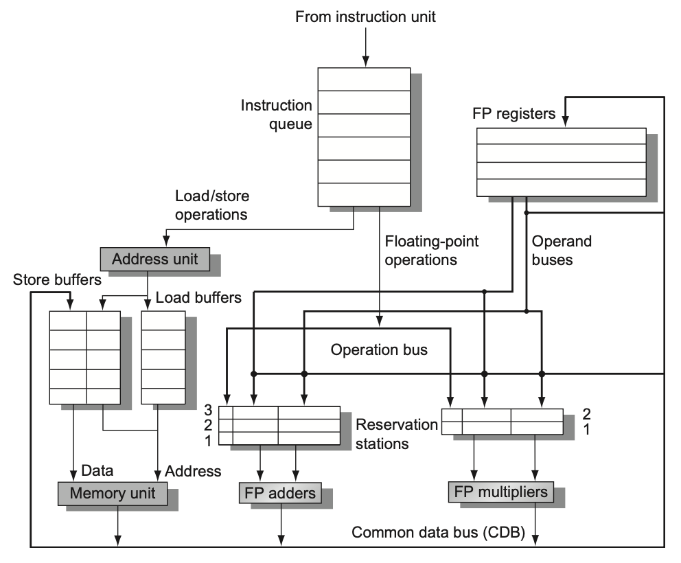

### Tomasulo 算法：总结

优点：

- 分布式冲突检测
    - 不同的 FU 有自己的保留站，提升了并行度
- 解决了 WAR 与 WAW 冲突
    - **隐式的（Implicit）寄存器重命名**
    - 想一想为什么？
- 能够在循环中多次迭代中重叠
    - 想一想为什么？

缺点：

- 需要解决同一时间发射多条指令、同一时间多个值写入 CDB 的问题
- 无法实现精确中断

### Scoreboard 算法：寄存器重命名

将 `R3` 重命名为 `R10` 以解决 WAW 冲突：

```asm
ADD R3, R1, R2    -->    ADD R3, R1, R2
ADD R5, R3, R4    -->    ADD R5, R3, R4
AND R3, R6, R7    -->    AND R10, R6, R7
ADD R9, R3, R8    -->    ADD R9, R10, R8
```

将 `R3` 重命名为 `R10` 以解决 WAR 冲突：

```asm
ADD R1, R3, R2    -->    ADD R1, R3, R2
ADD R3, R5, R4    -->    ADD R10, R5, R4
```

如此一来便没有 WAW 和 WAR 冲突了。

- 出现 WAW 和 WAR 冲突的原因是 ISA 没有提供足够的逻辑寄存器
- 不过我们可以设置**更多的物理寄存器**，对每一条需要写寄存器的指令，都为其分配一个新的物理寄存器（或是其他方式）
    - 完成之后，物理寄存器的值会被写回到逻辑寄存器中
    - 需要知道是否有 free 的物理寄存器，维护一个 free list
- 需要维护一张物理寄存器到逻辑寄存器的映射表

Scoreboard 算法的寄存器重命名是一种**显式（explicit）**的寄存器重命名，也即**真正**为其分配了新的寄存器。

好处有：

- 值可以直接从寄存器取，不需要从保留站来进行 bypass
- 提供了一种实现精确中断的方法（后面会讲到）

## 分支预测

### 控制冲突

组成课中已经讲到，分支指令的存在，可能会导致控制冲突。常见的解决方法有：

- stall
    - 遇到分支指令，直接停顿直至分支指令完成
    - 缺点：性能损失
- 预测
    - 静态预测
    - 动态预测

### 静态分支预测

常见的静态预测有：

- 预测分支总是不跳转
- 预测分支总是跳转

!!! info "Taken or not taken?"
    统计数据显示，大多数分支是跳转的，所以总是预测跳转的**策略**更好。

    但是，总是预测跳转的**实现**相对于总是预测不跳转的实现更复杂，因此在实际中可能会选择总是预测不跳转。

### 动态分支预测

都是基于硬件实现的，常见的有：

1. 1-bit predictor
2. 2-bit predictor
3. correlating predictor
4. tournament predictor
5. branch target buffer (BTB)
6. integrated inst. fetch units
7. return address predictor

**1. 1-bit predictor** / 一位预测器

顾名思义，就是用一个位来表示分支是否跳转。例如某个指令上一次跳转了，就设置为 1，否则设置为 0。下次遇到，如果是 1 就预测跳转，否则不跳转。预测错了，就修改这个位。

可以用一张表来记录是否跳转，叫做 **分支历史表（Branch History Table, BHT）**。可以用 PC 的低几位作为索引。

- 优点：硬件简单
- 缺点：预测准确率低
    - 想一想最坏情况？

**2. 2-bit predictor** / 两位预测器

顾名思义，就是用两位来表示分支是否跳转。一般分为四个状态：

- 00：strongly not taken
- 01：weakly not taken
- 10：weakly taken
- 11：strongly taken

每一个跳转指令由 `00` 开始，跳转一次就加 1，直到 `11`。不跳转就减 1，直到 `00`。当寄存器为 `00` 或 `01` 时，预测不跳转；当寄存器为 `10` 或 `11` 时，预测跳转。

相比于一位预测器，**为决策添加了滞后性**。

**拓展：N-bit predictor** / N 位预测器

- 共有 $2^N$ 个状态
- 预测不跳转的状态为 $0, 1, \ldots, 2^{N-1}-1$
- 预测跳转的状态为 $2^{N-1}, 2^{N-1}+1, \ldots, 2^N-1$
- 如果预测错了，就将状态加 1 或减 1

实际上大多数还是 2-bit predictor。

???+ important "Example"
    **(23-24 Final)** What is the prediction accuracy of a 2-bit predictor working on a loop which takes branches of 3n+1 and 3n+2, and not taken branches of 3n?

    ??? note "参考答案"
        **Answer**:

        2 / 3 = 66.67%

**3. Correlating predictor** / 相关预测器

- 许多分支指令**依赖于别的分支指令的结果**
    - 这个时候仅仅按照自己的跳转历史来预测就不够了
- 相关预测器有两个 bits：
    - 1st bit：上一次分支的结果是 NT，看 1st bit
    - 2nd bit：上一次分支的结果是 T，看 2nd bit

!!! warning "注意"
    “上一次分支”可能是同一条指令，也可能是不同的指令。

|预测组合|上一次Br为NT,预测本次位(看第一位)|上一次Br为T,预测本次为(看第二位)|
|:---:|:---:|:---:|
|NT/NT|NT|NT|
|NT/T|NT|T|
|T/NT|T|NT|
|T/T|T|T|

**Correlating Branches prediction buffer** / 相关分支预测缓冲区

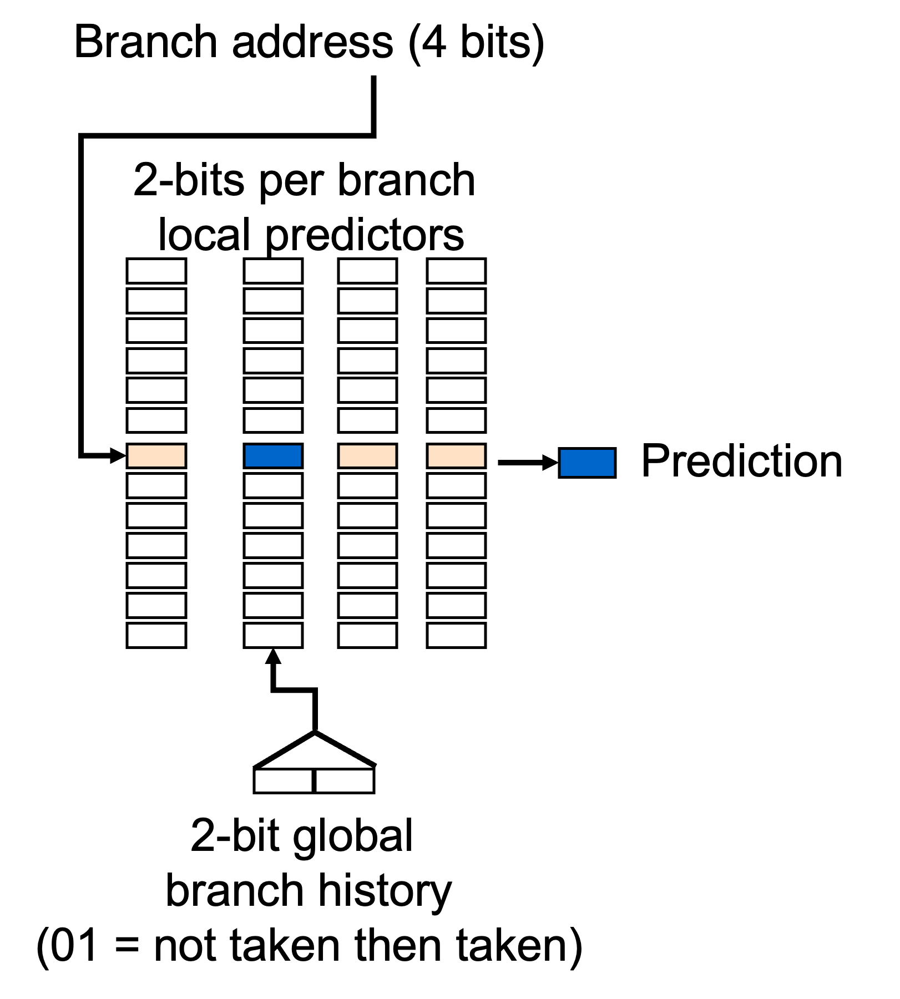

为了记录跳转历史，需要一个缓冲区

- 可以用 PC 的低几位作为索引
- (m,n) predictor
    - m：参考最近的 m 条分支指令的历史
    - n：每个分支预测器是 n 位的
- 例如 (2,2) predictor
    - 参考最近的两条分支指令的历史，一共有 $2^2=4$ 种状态

???+ important "Example"
    **(23-24 Final)** Consider a Correlating Branches Prediction Buffer using (2,2) predictor with 4K entries. How many bits are needed to implement the predictor? 

    ??? note "参考答案"
        **Answer**:

        $2^2 \times 2 \times 4K = 32K$ bits.

**4. Tournament predictor** / 饱和预测器

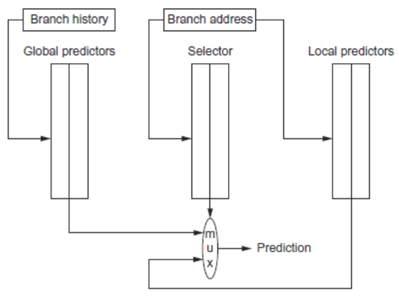

- 前一种相关预测器中，两条指令的 PC 后几位相同时有可能互相干扰
- 饱和预测器采用两个 predictors
    - 一个是 global，另一个是 local
    - 根据跳转地址来选择使用哪个 predictor

**4\*. Gshare predictor** / Gshare 预测器

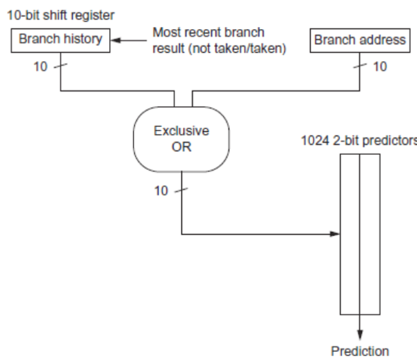

- 将最近的 m 条分支指令的历史与 PC 的低几位进行异或运算
- 根据这个结果进行选择，从 1024 个 2-bit predictors 中选择一个进行预测
- 免去了 1024 \* 1024 个预测器的存储开销

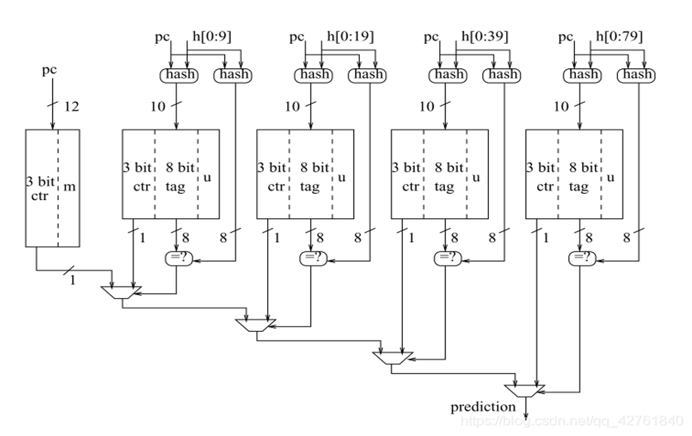

Prediction by Partial Matching (PPM)

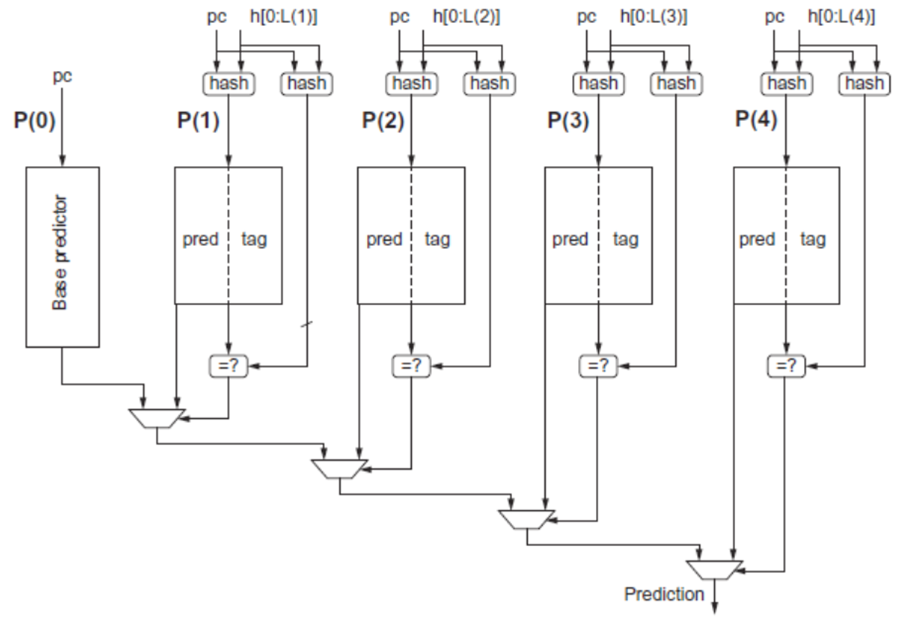

Tagged Hybrid Predictors / TAGE(TAgged GEometric history length branch prediction)

**5. Branch Target Buffer (BTB)** / 分支目标缓冲区

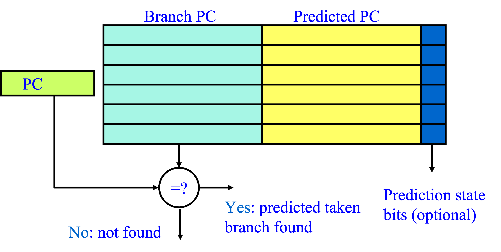

- 既然有可能会跳转，可以先把**目标地址**存起来
- 更甚，可以把目标地址的**指令**也存起来
- 跳转成功之后，直接取出即可
- 更甚，把 taken 和 not taken 的指令都存起来

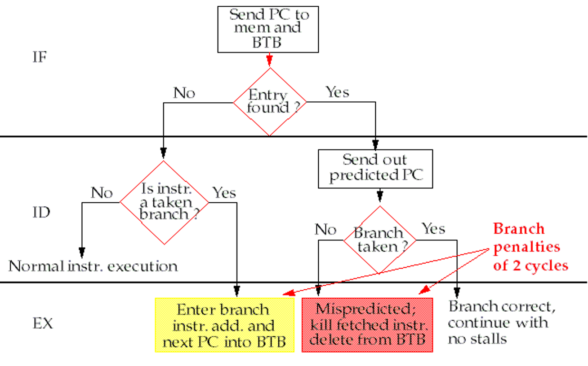

**6. Integrated Instruction Fetch Units** / 集成取指部件

- 配合刚才的 BTB，把转移预测器和取指部件集成在一起
- 转移的时候，把 taken 和 not taken 的指令都预取
- 对 memory 的带宽要求更高

**7. Return Address Predictor** / 返回地址预测器

- call 和 return 是另一种跳转的方式
- 把返回地址与 PC 结合起来
- 将 ra 存入一个小的 buffer，减少对堆栈的访问

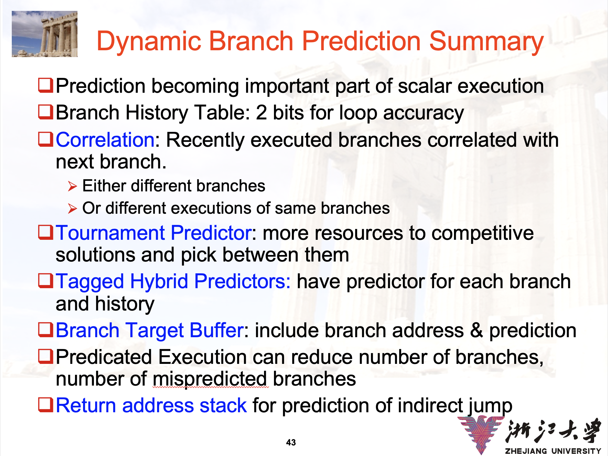

## 猜测执行（Speculation）

### Hardward-Based Speculation

- Tomasulo 能够实现一些跨越基本块的乱序执行
- 但是前提是在 issue 下一个基本块之前，分支结果已经确定
- 如果分支结果还没有确定，就需要猜测执行
    - 假装分支结果已经确定，按照 predict 的结果执行
    - **需要 handle 预测失误的情况，也即需要支持 rollback**
        - 如何支持？

### Instruction Commit

- 为了支持 rollback，把程序分为【指令执行】+【指令提交】两个阶段
- 按照预测的方向执行程序，但是只 commit 能够确定正确的指令
- 所谓 commit 就是允许将结果写回到寄存器和内存中
    - 联想数据库的【事务提交】
- 所以需要一个**提交缓冲区**，用来存储已经执行的指令
    - 在 Tomasulo 中，这个东西叫做 ReOrder Buffer（ROB）

### ROB in Tomasulo

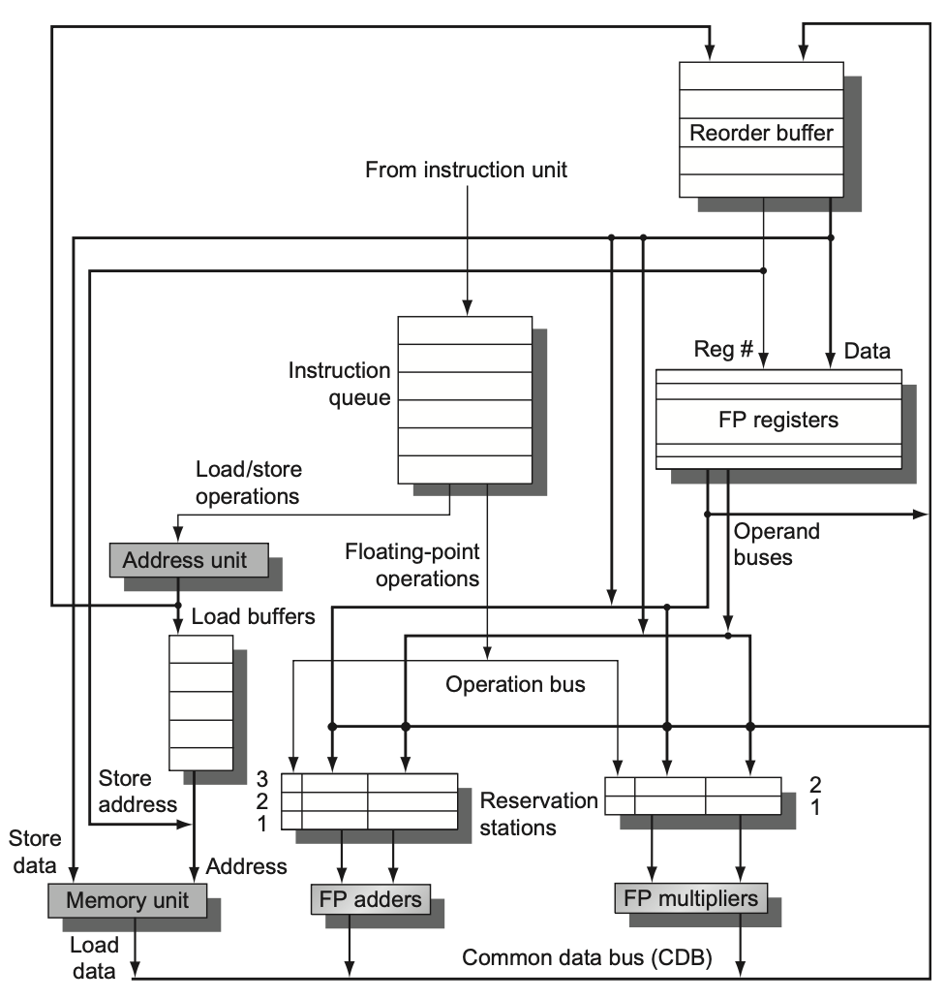

ROB 在 Tomasulo 中可以扮演保留站的角色，且不仅仅是如此。

- 作为循环 FIFO 队列来实现顺序提交
- 在指令【完成执行】和【提交】之间缓存结果
- 为普通指令和投机指令提供额外的寄存器作为操作数
- 也可以作为存储缓冲区，因此不需要原来的 store buffer 了

在这里，我们还是需要保留站来缓存操作数，唯一的区别是我们用 ROB 的编号来标记结果。

### ROB in Tomasulo(cont.)

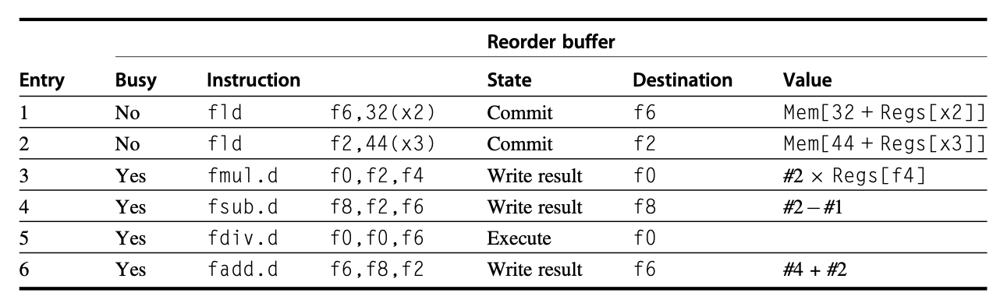

ROB 的一行通常包括：

- 指令类型
- destination register / memory address
- 结果值
- 是否完成
- 中断向量地址

### Speculation in Tomasulo

指令执行分为以下阶段：

1. **Issue**
    - 保留站和 ROB 都 free 的时候，发射指令
    - 预填相关信息
2. **Execute**
    - 执行指令
    - 注意检查 RAW
3. **Write Result**
    - 将结果写入 CDB 和 ROB
4. **Commit**
    - 对 ROB 的头部指令，如果是普通指令
        - 将结果写回到寄存器和内存
        - 将这条指令从 ROB 中删除
    - 如果是分支指令
        - 正确，则当作普通指令 commit
        - 错误，则清空 ROB 中的所有指令（也叫 flush）

!!! info "想一想"
    指令提交是什么顺序？

通过以上的讨论，我们可以知道：

- 带预测执行 ROB 的 Tomasulo 是
    - 顺序发射
    - 乱序执行、乱序完成
    - 顺序提交
- 进而**实现了精确中断**

!!! warning "Memory Disambiguation"
    如同寄存器一样，内存中的数据也可能发生 RAW 冲突。

    例如：

    ```asm
    ST	0(R2), R5	   	
    LD	R6,    0(R3)
    ```

    在编译的时候，两个地址可能还不知道是否一样。所以在 load 的时候，要先比对一下 ROB 中的 store 相关的地址。

???+ important "Example"
    **(23-24 Final)** 带投机的 Tomasulo，在 (1) 有空余情况下可以 Issue，Issue 后，可以从 (2) 读取 operand 值到 (3)。

    **A.** Reservation Station

    **B.** Reorder Buffer

    **C.** Reservation Station and Reorder Buffer

    **D.** Reservation Station or Reorder Buffer

    ---

    **A.** Reorder Buffer

    **B.** Register

    **C.** Reorder Buffer and Register

    **D.** Reorder Buffer or Register

    ---

    **A.** Reservation Station

    **B.** Function Unit

    ??? note "参考答案"
        **Answer**:

        (1) C; (2) D; (3) A.

## 小结：动态调度


