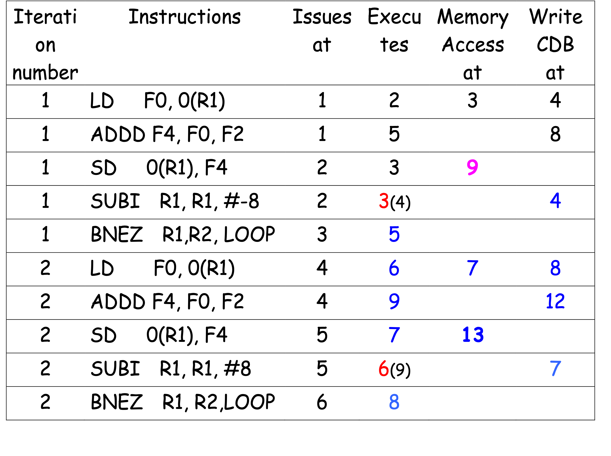
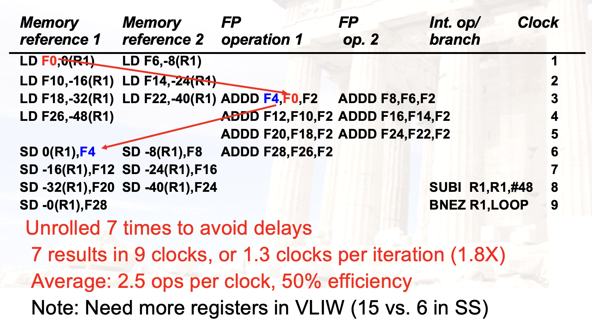
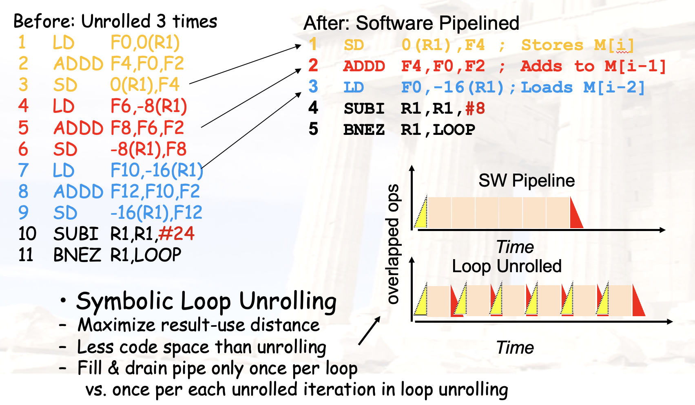
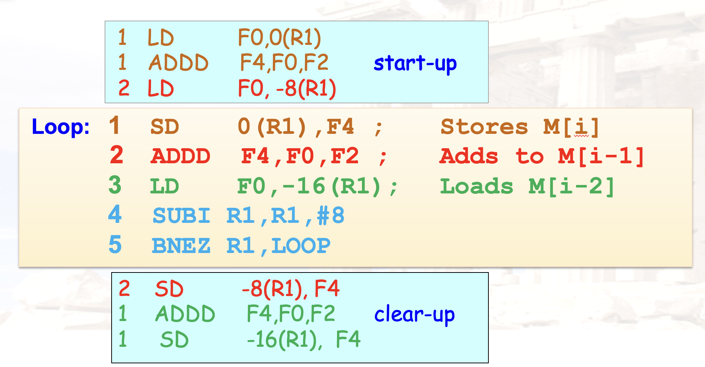
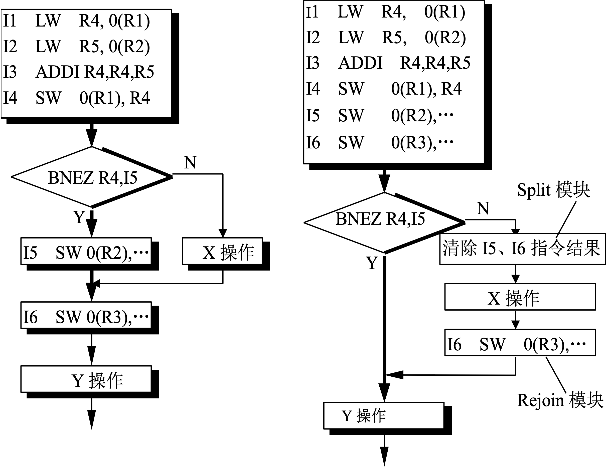
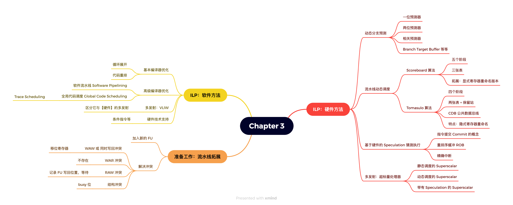

# Chapter 3-3：多发射与编译器优化

??? abstract "目录"
    - ILP
        - 硬件方法
            - （多发射）超标量处理器
        - 软件方法
            - 编译器优化
            - 分支预测
            - （多发射）VLIW
    - 其他

## 多发射处理器

### 多发射的目的

- 之前我们所做的一切都是为了减小 CPI，使其接近 ideal CPI。
    - 这里的 ideal CPI 最少也是 1。
- 能否拓展 ideal CPI 的新下限？
    - 允许多条指令在一个周期内发射，使得 **ideal CPI < 1**。

### 多发射的方式


## 超标量（Superscalar）

### 超标量的定义

- 处理器在同一个周期内同时发射 n 条指令
    - n 一般是 1 到 8
- 最好能让所有的 function unit 都能同时工作
    - 最大化利用率

- 静态调度的 Superscalar
    - 编译器技术优化
    - 顺序执行
- 动态调度的 Superscalar
    - 基于 Tomasulo 算法
    - 非顺序执行

### 静态调度的 Superscalar


- 处理器在发射指令时已经知道了指令之间的依赖关系（硬件实现）
- 将指令打包成 issue packet
- 将 issue 过程分割并流水化
    - 先决定 packet 内的指令
    - 再看 packet 之间的冲突

!!! warning "注意"
    - 在一个周期内需要完成 issue check，限制了 clock cycle time。
        - 对于 N 发射来说，比较的次数在 $O(N^2 - N)$
    - 更高的发射率也会导致**更高的分支预测失误损失**
        - 需要提升分支预测的准确率

### 静态调度的 Superscalar：问题

- 发射阶段要完成所有的冲突检查
    - > Even 2-scalar => examine 2 opcodes, 6 register specifiers, & decide if 1 or 2 instructions can issue; (N-issue ~O(N2-N) comparisons)
    - 重命名逻辑也需要在一个周期内完成
- 相应的寄存器读写口、result buses、forwarding paths 也需要增加

### 代码重排与循环展开

```asm
Loop: LD    F0, 0(R1)
      ADDD  F4, F0, F2
      SD    0(R1), F4
      SUBI  R1, R1, 8
      BNEZ  R1, Loop
      NOP
```

```plaintext
F D X M W          |
  F D s X X X X W  |
    F s D s s X M W|
        F s s D X M|W
              F s D|X M W
                  F|F
```

一共 10 个 cc。

| **Inst. Producing Result** | **Inst. Consuming Result** | **Execu. cycles** | **Latency** |
|---------------------------|---------------------------|------------------|-------------|
| FP ALU op | FP ALU op | 4 | 3 |
| FP ALU op | Store Double | 3 | 2 |
| Load Double | FP ALU op | 1 | 1 |
| Load Double | Store Double | 1 | 0 |
| Integer op | Integer op | 1 | 0 |

!!! info "想一想"
    如何理解这张表？

重排：

```asm
Loop: LD    F0, 0(R1)
      SUBI  R1, R1, 8
      ADDD  F4, F0, F2
      BNEZ  R1, Loop
      SD    8(R1), F4
      NOP
```

```plaintext
F D X M W  |
  F D X M W|
    F D X X|X X W
      F D X|M W
        F D|s X M W
          F|s D X M W
```

一共 6 个 cc。

再举个例子：

```asm
1 Loop:      LD    F0,0(R1)
2          ADDD    F4,F0,F2
3          SD    0(R1),F4         ;drop SUBI & BNEZ
4          LD    F6,-8(R1)
5          ADDD    F8,F6,F2
6          SD    -8(R1),F8       ;drop SUBI & BNEZ
7          LD    F10,-16(R1)
8          ADDD    F12,F10,F2
9          SD    -16(R1),F12
10          LD    F14,-24(R1)
11          ADDD     F16,F14,F2
12          SUBI    R1,R1,#32      ;alter to 4*8
13          SD    +8(R1),F16
14          BNEZ    R1,LOOP
15        NOP

  14 + 3 x (1+2) +1 +1 +1= 26 clock cycles, or 6.5 per iteration
   Assumes R1 is multiple of 4
```

重新组织：

```asm
1 Loop:    LD    F0,0(R1)
2        LD    F6,-8(R1)
3        LD    F10,-16(R1)
4        LD    F14,-24(R1)
5        ADDD    F4,F0,F2
6        ADDD    F8,F6,F2
7        ADDD    F12,F10,F2
8        ADDD    F16,F14,F2
9        SD    0(R1),F4
10        SD    -8(R1),F8
11        SUBI    R1,R1,#32
12        SD    +16(R1),F12
13        BNEZ    R1,LOOP
14      SD    8(R1),F16    ; 8-32 = -24

 14 clock cycles, or 3.5 per iteration
```

需要注意：

- 重排需要保证数据依赖关系
    - 以及相应的逻辑正确性
    - 对于寄存器的依赖检查比较容易做
    - 对于内存的依赖检查比较难
- 例如对于上面的例子，做重排的时候实际需要做出
    `0(R1) != -8(R1) != -16(R1) != -24(R1)`
    的假设
- 此外，一般不会一次性全部展开

    1. 先执行 `n % k` 次循环
    2. 然后就进行展开后的 `n / k` 次迭代
    3. 对于较大的 `n`，大部分时间花在 step 2 上

### 动态调度的 Superscalar

- 克服上述的 issue restriction
    - pipeline：将 issue 检查流水化，一条指令的检查在半个周期内完成，两条就可以在一个周期内完成
    - widen issue logic：将 issue 检查的逻辑宽度加大，一次能检查多条指令
- 例如如下指令

```asm
Loop: L.D       F0, 0(R1)
      ADD.D     F4, F0, F2
      S.D       F4, 0(R1)
      DADDIU    R1, R1, #-8
      BNE       R1,R2, Loop 
```


- 1 mem unit, 1 integer unit, 1 FP unit
- 指令 1 与 2、4 与 5、6 与 7 之间有数据依赖
- 指令 3 与 4、6 与 8、8 与 9 之间有结构冲突
    - 可以看出在这个例子中，integer unit 是一个瓶颈



- 可以把地址计算与访存分开，流水化
- 注意到指令 1 与 4 同时完成准备写回，会发生冲突
    - 可以将写回的时间错开，或是用两条 write CDB（比较难实现）

### 带有猜测执行的 Superscalar

- 可以把原来的 Speculation 处理器改成多发射
- 需要处理多个指令同时 commit 的情况
- 例如如下指令

```asm
Loop: LD        R2, 0(R1)
      ADDI      R2, R2, #1
      SD        R2, 0(R1)
      ADDI        R1, R1, #4
      BNE        R2, R3, Loop
```

*这里假设 ALU、Load/Store、Branch 都使用独立的 integer unit*


没有引入 speculation 的情况 ->

- 跳转指令单独发射
- 后续指令需要等待跳转结果出来后再执行


引入 speculation 的情况 ->

- 跳转指令单独发射
- 这里预测不跳转，所以后面的指令可以提前执行
- **需要注意按序提交**

## ILP：软件方法

### 软件方法

- 基本编译器优化技术
    - 循环展开
- 静态的分支预测
- 静态的多发射：VLIW
- 高级编译器优化技术
    - 软件流水线
    - 全局代码调度
- 相应的硬件技术辅助

### 静态分支预测

- 预测跳转或不跳转
- 还可以根据条件跳转的方向来预测
    - 例如对于 `loop` 类型的，一般是向后，预测跳转
    - 对于 `if` 类型的，一般是向前，预测不跳转
- 根据前几次运行结果的 profile 来预测

### 静态多发射：VLIW

- Very Long Instruction Word
- 把几条指令打包成一个长指令
    - 确保一个长指令里面的指令之间都是独立的
    - 进而可以并行执行



有着不少问题

- 技术问题
    - code size 变大
    - 会有很多闲置的功能单元（因为找不到足够多的独立指令）
    - 某个功能单元的延迟会影响整个指令的延迟
- 兼容性问题
    - 不同的硬件实现，不同的指令集
- 发掘不到足够多的 ILP

### 高级编译器优化技术

**1. 软件流水线**

举个例子：

```asm
1    Loop: LD      F0,  0(R1)
2          ADDD    F4, F0, F2
3          SD      0(R1), F4
4          SUBI    R1, R1, #4
5          BNEZ    R1, LOOP
```

- 众所周知，指令 1、2、3 之间有数据依赖
- 但是这是一个循环
    - 可以展开后，在每一轮循环中挑一条



如此一来每一轮循环只需要 5 个时钟周期。（除开启动时间与排空时间）

这样，整个程序被重排为：



如果循环内部还有控制流跳转，可以使用：

**2. 全局代码调度**

- 能够跨越 branch 移动指令
- 一种常见的技术是 Trace Scheduling
    - 分为两步
    - Trace Selection：寻找一条 Basic Blocks 的串联执行路径
    - Trace Compaction：将 Trace 打包成几个 VLIW 指令
    - 是基于编译器的 Speculation

Trace Scheduling 的例子：



### 相应的硬件技术辅助

**例：Conditional Instructions**

- 某些指令集支持条件指令
- 例如 ARM 的 `ADDNE` 指令
- 可以将条件判断与指令结合
- 把控制冲突转换为数据冲突

## 总结一下



## 练习

???+ important "Example"
    In the following code segments, which one would benefit most from loop unrolling?

    ```c
    for(i = 0; i < 100; i++) {  // A
      Sum = Sum + A[i];
    }
    ```

    ```c
    for(i = 0; i < 100; i++) {  // B
      C[i] = A[i] + B[i];
    }
    ```

    ```c
    for(i = 0; i < 100; i++) {  // C
      C[i] = A[i-1] + B[i-1];
    }
    ```

    ```c
    for(i = 0; i < 100; i++) {  // D
      C[i] = C[i-1] + A[i];
    }
    ```

    ??? note "参考答案"
        Answer: B

???+ important "Example"
    Instructions in VLIW is scheduled by _________, while instructions in superscalar are scheduled by ___________.

    ??? note "参考答案"
        Answer: compiler, hardware

???+ important "Example"
    Which techique can be used to get ideal CPI less than 1?

    A. Loop unrolling

    B. Software pipelining

    C. Superscalar

    D. Pipelining

    ??? note "参考答案"
        Answer: C

???+ important "Example"
    Which method can be used to solve structural hazards in Scoreboard?

    A. Add more functional units

    B. Add more read ports to register file

    C. Add more write ports to register file

    D. All of the above

    ??? note "参考答案"
        Answer: D
