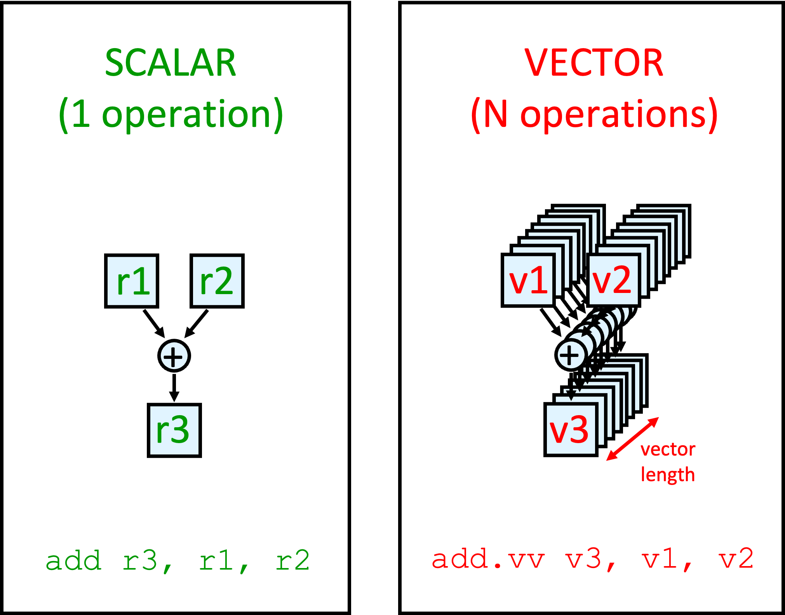
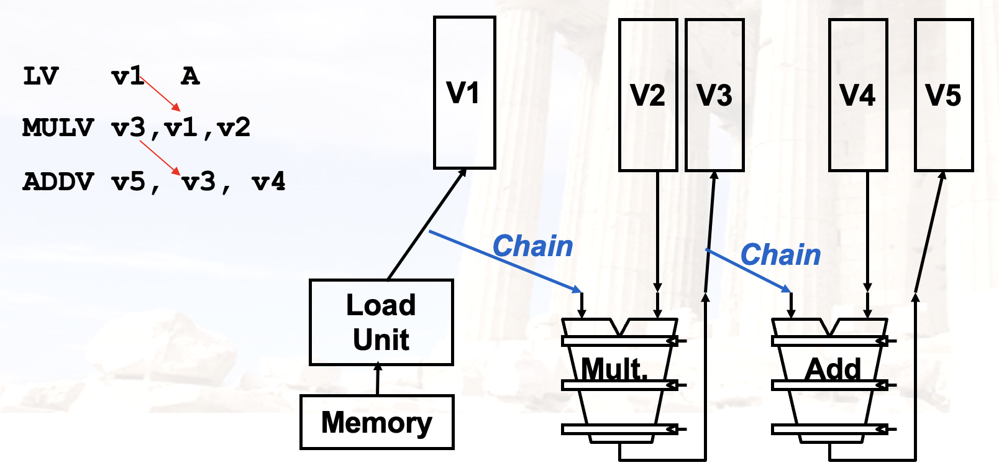
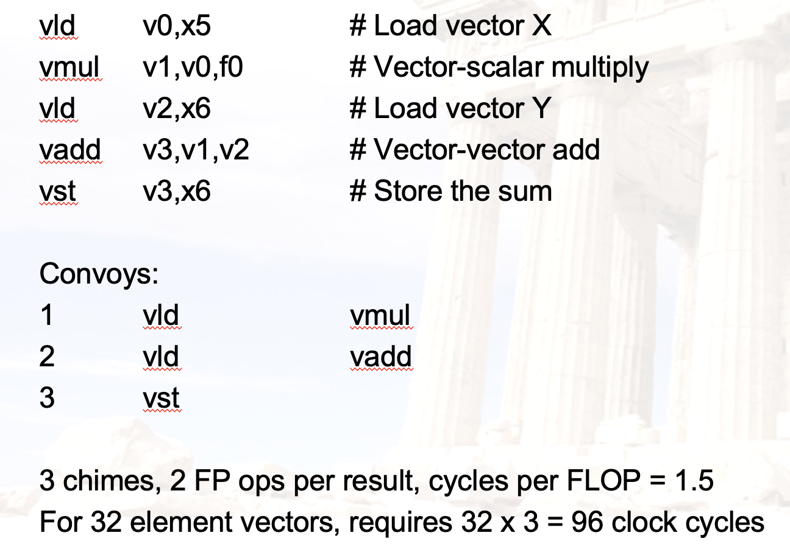
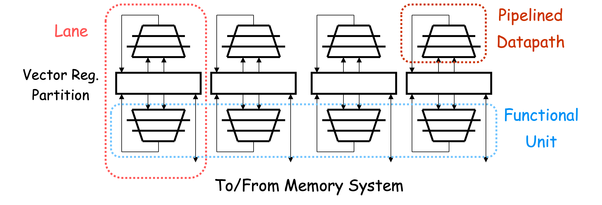

# Chapter 4：数据级并行（DLP）

??? abstract "目录"
    - DLP
        - 向量处理器（重要）
        - GPU
        - Loop-Level Parallelism（重要）

## DLP 概述

### 数据级并行

- 数据级并行（Data Level Parallelism, DLP）是指在数据流中存在大量的并行性。
- SIMD（Single Instruction Multiple Data）指令集架构是实现数据级并行的主要方法。常用在
    - 面向矩阵的科学运算
    - 面向媒体的图像/视频处理
- SIMD 比 MIMD 更高效也更节能，因为 SIMD 只需要一条指令流来控制多个数据流。
    - 移动设备用的比较广泛

## 向量处理器（Vector Processor）

### 向量处理器：概述



- **SIMD 的一种实现**：单独的一条指令能够对一串类似数组的数据（向量）进行操作
    - 节省了 instruction fetch 和 decode 的时间
- 每个计算结果不依赖于之前的结果
    - 编译器来保证没有数据依赖
    - 硬件无需检查数据以来，能够实现较高的 clock rate
- 为访存特殊设计
    - 高度交错的存储器
    - 无需 data cache
- 减少流水线中的 branch 问题

### 向量处理器：两种类型

- **memory-memory**
    - 直接操作内存中数据
    - CDC Star-100, TI ASC
    - 要求比较高的内存带宽
    - 检查 memory 的依赖相对复杂
- **vector register**
    - 先将数据加载到寄存器中，再进行操作
    - Cray-1(1976) 是第一个这样的机器
    - Includes all vector machines since late 1980s: Cray, Convex, Fujitsu, Hitachi, NEC
    - 后面的讨论中，默认是 vector register

例如对于程序

```c
for (i=0; i<N; i++)
{
  C[i] = A[i] + B[i];
  D[i] = A[i] - B[i];
}
```

```asm
# Memory-memory
ADDV C, A, B
SUBV D, A, B
```

```asm
# Vector register
LV V1, A
LV V2, B
ADDV V3, V1, V2
SV V3, C
SUBV V4, V1, V2
SV V4, D
```

### 向量处理器：结构

- Vector Register
    - 一个 vector 一般是定长的 bank 存放
- Vector Functional Unit
    - 完全流水化，每个周期都可以开始新的操作
- Vector Load-Store Unit
    - 也是完全流水化的
- Scalar Register
    - 用于存放 scalar 数据

### 向量处理器：缺点

- 如果数据并行性不高，比较不高效
- 内存带宽可能是瓶颈

### 向量处理器：执行时间

取决于：

- 向量长度
- 结构冲突与数据冲突

RV64V 指令集中的 FU 一个周期可以处理一个向量元素，因此

- **其执行时间可以认为是向量的长度**

### 向量处理器：内存操作

三种寻址方式：

- Unit stride
    - 每次访问一个元素
    - 最快
- Non-unit(constant) stride
    - 每次访问一个常数倍的元素
- Indexed(gather-scatter)
    - 对于稀疏矩阵比较有用

### 向量处理器：向量长度

- 每个机器有自己的最大向量长度 MVL
    - 一条指令最多能处理 MVL 个元素
- 向量长度 VL 需要小于等于 MVL

!!! info "想一想"
    如果说 VL > MVL，应该怎么办？

**Strip Mining**

- 生成多个 MVL 长度向量的循环
- 例如 N > MVL, N < 2*MVL
    - 先处理 N mod MVL 个元素
    - 然后处理 MVL 个元素

### 向量处理器：提升性能

**1. Vector Chaining（重要）**

- 向量版本的 bypassing/forwarding
- 在这里，RAW 冲突反而是有利的



- 对于前后依赖性的指令来说，
    - 没有链接技术，需要等到前一条指令最后一个分量完成才能开始下一条指令
    - 有链接技术，前一条指令的第一个分量完成后就可以开始下一条指令的第一个分量
- 几个概念
    - Convey：一组可以放在一块执行的指令
    - Chimes：通过链接技术产生的执行序列
    - Chaining：链接技术

举个例子：



**2. Conditional Execution**

- 之前讲过。有的指令集能够用一条指令完成判断与执行
- 拓展：Masked Vector
    - 通过掩码来控制向量的执行
    - 例如，掩码为 1010，只有第 0 和第 2 个元素会被执行
    - 这样在执行的时候先扫描一遍掩码，只执行需要的元素
    - 传输数据也可以只传输需要的元素，来节省带宽

**3. Sparse Matrix**

对于稀疏矩阵，访问或存入可以使用 Gather/Scatter 操作：

- 只把需要的元素的索引传输到寄存器中
- 存入的时候，只存入需要的元素

```c
for (i=0; i<N; i++)
    A[i] = B[i] + C[D[i]]
```

```asm
LV            VD, RD        ; Load indices in D vector
LVI    VC,(RC, VD)   ; Load indirect from RC base
LV     VB, RB      ; Load B vector
ADDV.D     VA, VB, VC      ; Do add
SV     VA, RA      ; Store result
```

**4. Multi-Lane Implementation**

- 多道存储与计算
- 同一个向量的不同分量都可以在不同的 lane 上执行



## GPU

### GPU：概述

- 一种外部的执行设备
    - CPU 负责控制，GPU 负责计算
- 需要为 GPU 开发一个类似 C 语言的编程语言
    - Single Instruction Multiple Threads

### GPU：术语

- Thread
    - 处理数据的线程
- Block
    - 一组线程
    - Blocks are organized into a grid
    - Grid：线程块的集合
- **GPU 实际上是对线程进行操作，而不是应用或操作系统**

### NVIDIA GPU

- 与向量机的相同
    - DLP
    - Scatter-gather Transfer
    - 掩码向量
    - 较大的寄存器

- 与向量机的不同
    - 没有标量处理器
    - 通过多线程来减小内存延迟
    - 有非常多的 FU
        - 相比之下，向量机的 FU 数量比较少，但都是流水化的

## Loop-Level Parallelism

### Loop-Level Parallelism

- 基于循环的并行性
- **主要看循环的迭代之间是否有数据依赖（Loop-carried dependence）**

```c
for (i=999; i>=0; i=i-1)
    x[i] = x[i] + s;  // 没有循环间依赖
```

```c
for (i=0; i<100; i=i+1) {
    A[i+1] = A[i] + C[i]; /* S1 */
    B[i+1] = B[i] + A[i+1]; /* S2 */
} // 有循环间依赖
```

循环间依赖可以通过改写来解决：

```c
for (i=0; i<100; i=i+1) {
    A[i] = A[i] + B[i]; /* S1 */
    B[i+1] = C[i] + D[i]; /* S2 */
} // 有循环间依赖
```

改写为：

```c
A[0] = A[0] + B[0];
for (i=0; i<99; i=i+1) {
    B[i+1] = C[i] + D[i];
    A[i+1] = A[i+1] + B[i+1];
}
B[100] = C[99] + D[99];  // 没有循环间依赖
```

## 练习

??? important "Example"
    **(24 Fall Final)** Suppose a vector machine running program like this:

    ```asm
    vld v1, x1
    vadd v3, v1, v2
    vld v4, x2
    vmul v5, v4, v3
    vsd v5, x3
    ```

    the vector length is 64. Instruction fetch needs 1 cycle, fully-pipelined ADD needs 7 cycles, load & store needs4 cycles, and multiply needs 10 cycles.

    (1) What is the total execution time without chaining(vector link)?

    (2) How many conveys are there if chaining is used?

    (3) What is the total execution time with chaining?

??? important "Example"
    **(24 Fall Final)** Answer questions below:

    (1) Are there loop-carried dependencies in the following code segments?

    ```c
    for (i=0; i<100; i=i+1) {
        A[i+1] = A[i] + C[i]; /* S1 */
        B[i+1] = B[i] + A[i+1]; /* S2 */
    }
    ```

    (2) Given the following code segment, first find three types of data dependencies, then rewrite the code using register renaming to eliminate output dependencies and name dependencies.

    ```c
    for (i=0; i<99; i=i+1) {
        A[i] = A[i] * B[i]; /* S1 */
        B[i] = A[i] + c; /* S2 */
        A[i] = C[i] * c; /* S3 */
        C[i] = D[i] + A[i]; /* S4 */
    }
    ```

    (3) Rewrite the code below so that it can be vectorized.

    ```c
    for (i=0; i<99; i=i+1) {
        A[i] = A[i] + B[i]; /* S1 */
        B[i+1] = C[i] + D[i]; /* S2 */
    }
    ```
