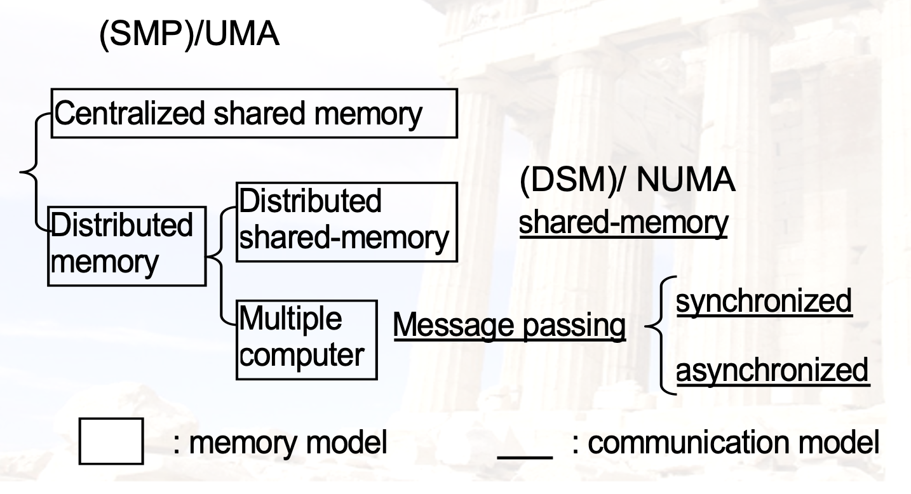
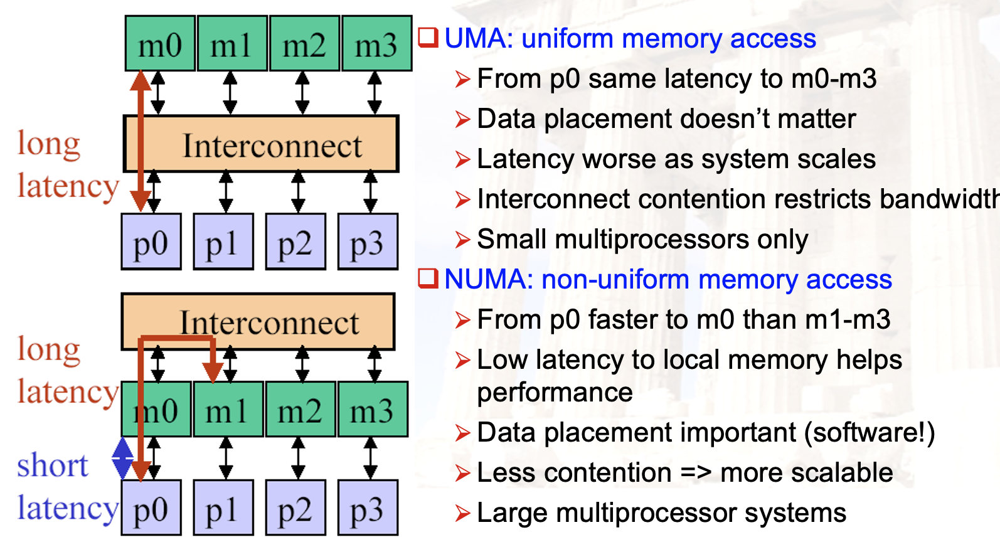
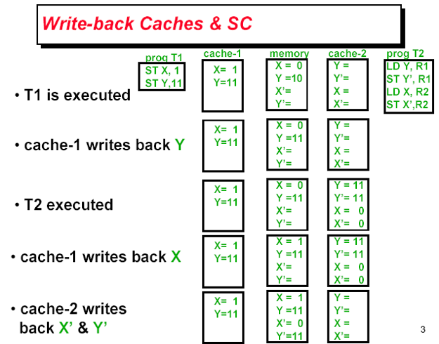
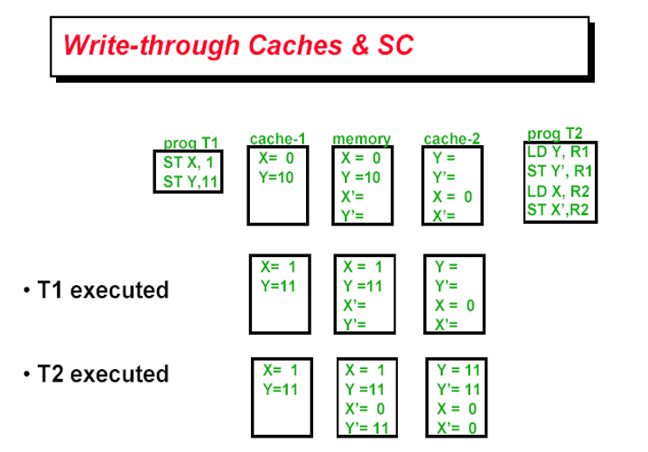
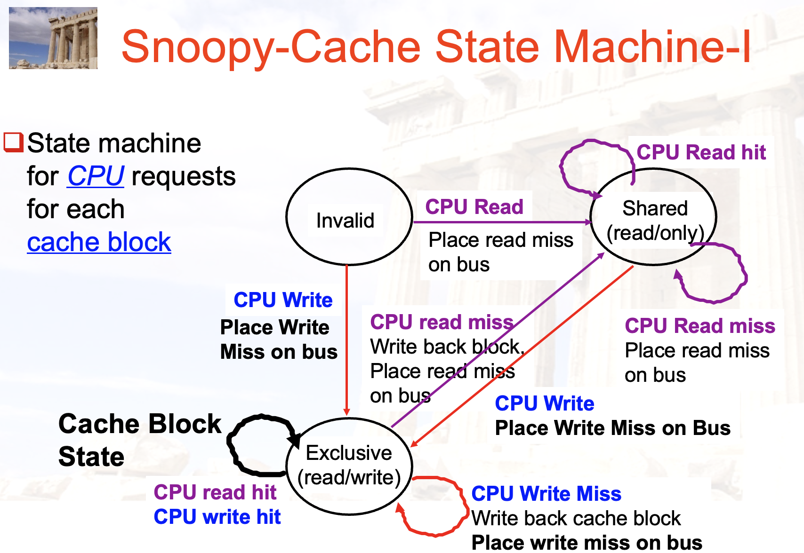
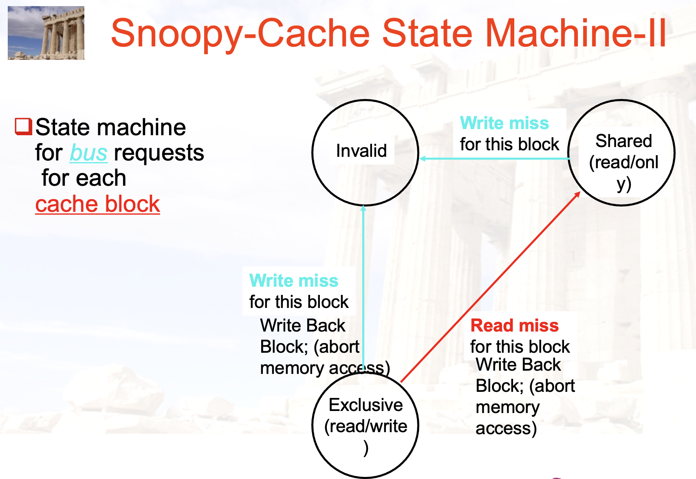
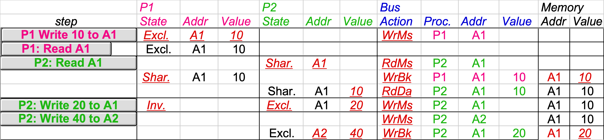
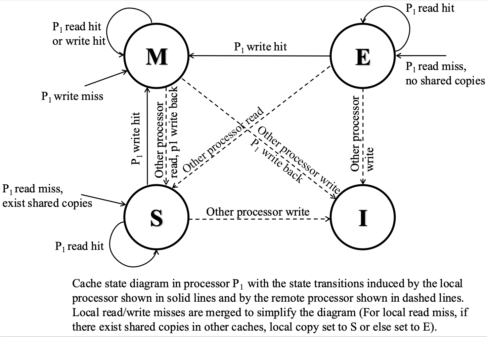
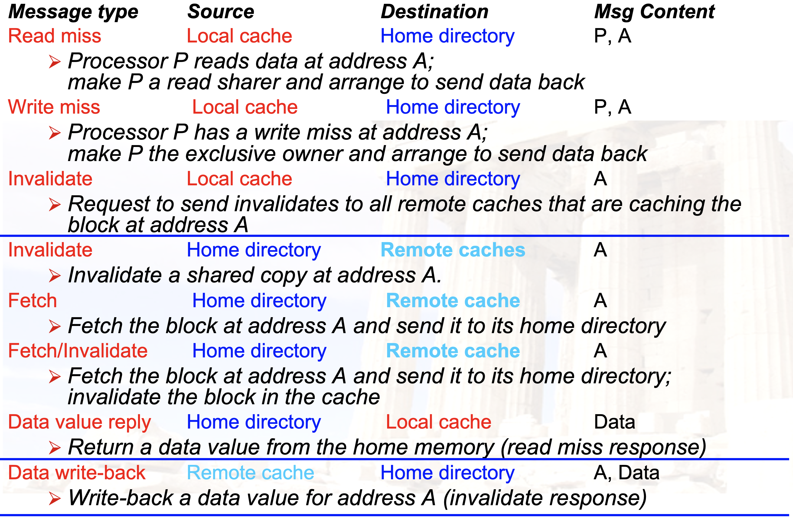

# Chapter 5：线程级并行（TLP）

??? abstract "目录"
    - TLP
        - 多处理器
        - 缓存一致性
        - 线程同步
        - 内存连续性

## 多处理器（MultiProcessor）

### 多处理器：概述

**为什么要使用多处理器？**

- 提升性能
- 单处理器性能瓶颈

- 多处理器属于 MIMD（Multiple Instruction Multiple Data）架构
- 内部还可以继续划分

### 多处理器：分类



### UMA vs. NUMA



### 编程模型

- Multiprogramming：无交流
- Shard Address Space：通过内存共享
- Message Passing：通过消息传递
- Data Parallel：在不同数据上同时处理，并全局实时交换信息

### 多处理器：问题

- 有限的程序并行性
- 处理器之间的通信延迟
    - 硬件解决方法：缓存共享数据
        - 带来了问题：缓存一致性
    - 软件解决方法：同步

## 缓存一致性（Cache Coherence）

### 缓存一致性：例子





### 缓存一致性：定义

在 Shared Memory 情况中，对同一块内存，可能有不同的处理器进行读写操作。如果每个处理器有自己的缓存，那么就会出现一个问题：当一个处理器修改了内存中的数据，其他处理器的缓存中仍然保留着旧的数据。因此需要：

- P1 Read[X] => P1 Write[X] => P1 Read[X] will return X
- P2 Read[X] => P1 Write[X] => will return value written by P1
- P1 Write[X] => P2 Write[X] => Serialized (all processor see the writes in the same order)

总的来说，就是需要保证对同一个地方的**写保持序列化**。

课程介绍两种策略：

- 监听策略（snooping）
- 目录策略（directory-based）

### Snooping 协议：概述

- 处理器之间可以通信
- 如果 P1 写入 X，需要通知其他的处理器
- 其他处理器监听通知，并作出相应操作
    - 如果自己的 cache 也含有 X 的副本，根据策略进行处理
        - Write Invalidate：将 X 的副本置为无效
        - Write Broadcast：将 X 的副本置为最新（由 P1 写入）
- 这里的写序列化是通过 bus 来实现的

### Snooping 协议：状态机

每块缓存接收两种信号：

- Processor（来自自己所在的处理器）
    - CPU Read, CPU Write
- Bus（来自其他处理器）
    - BUS Read, BUS Write

在教材的 Simple write-invalidate protocol 例子中，每个缓存块有三种状态：

- Invalid：无效（Valid = 0）
- Shared：共享（Valid = 1, Dirty = 0）
- Exclusive：独占（Valid = 1, Dirty = 1）





### Snooping 协议：例子




### 拓展：MESI 协议



### 目录协议：概述

- 记录内存中每一块的状态
    - 这个状态叫做 directory
- 目录中的内容
    - 每一块的状态：shared/uncached/exclusive
    - 哪些处理器有这个块的副本：用 bit vector 来表示
    - dirty/clean
- 可以在 distributed memory 中实现，也可以在被组织成 banks 的 centralized memory 中实现

### 目录协议：原理

对一个内存的操作，涉及三个处理器的概念：

- Local node：发起请求的处理器
- Home node：对应内存地址所在的处理器
- Remote node：拥有这个副本的处理器



## 同步（Synchronization）

### 同步：概述

- 多个线程对同一块内存进行读写
- 需要保证对同一块内存的读写是有序的
- 一般使用**硬件原语**来实现
    - 不被打断的 fetch&update memory 操作
- 对于大型多处理器来说，同步经常是一个性能瓶颈

### 同步：原语

常见的硬件原语：

- Atomic Exchange：寄存器与内存交换
- Test-and-set：测试并设置
- Fetch-and-increment：取出并加一

这些操作都是原子性的，不能被打断

我们可以用这些原语来实现一些常见的同步操作，例如锁：

```asm
# 使用 Atomic Exchange 实现锁
          DADDUI     R2, R0, #1
lockit:   EXCH       R2, 0(R1)
          BNEZ       R2,  lockit
```

```asm
# 使用 Test-and-set 实现锁
lockit:   T&S          R2, 0(R1)
          BNEZ       R2,  lockit      
```

对于取出、加一并存回的操作，很难在一个周期内完成，这里使用**一对原子操作**来实现：

- **Load-Linked**：取出并存入寄存器（RISC-V 中叫做 load-reserved）
- **Store-Conditional**：存入内存
    - 如果在 Store-Conditional 之前，内存没有被其他处理器修改，那么就可以成功存入
    - 否则失败，返回失败信号
- 将共享数据的读写操作分开

- 可以通过 LL 与 SC 实现：

```asm
# Atomic Exchange
try:	mov x3,x4		;mov exchange value
    lr x2, x1			;load reserved from
    sc x3,0(x1)		;store conditional
    bnez x3,try		;branch store fails
    mov x4,x2		;put load value in x4?
```

- 也可以通过 LL 与 SC 实现：

```asm
# Fetch-and-increment
try:	lr x2,x1			;load reserved 0(x1)
    addi x3,x2,1		;increment
    sc x3,0(x1)		;store conditional
    bnez x3,try		;branch store fails
```

### 实例：Spinlock

用户级别的同步方式。处理器不断地检查一个变量的值，直到它变成 0。这个变量叫做锁。

```asm
          addi	x2, x0，#1		
lockit:		EXCH	x2,0(x1) 	;atomic exchange
          bnez	x2,lockit 	;already locked?
```

可以看到每一次尝试 EXCH 都会导致总线的开销，性能较差。

优化：

```asm
try:	    li	    x2,#1	
lockit:   lw	   x3,0(x1)       ;load var
          bnez	   x3,lockit       ;not free=>spin
          EXCH  x2,0(x1)       ;atomic exchange
          bnez	   x2,try 	          ;already locked?
```

也可以用 LL 与 SC 来实现：

```asm
lockit: LL	       x2,0(x1) 	    ;load linked
        BNEZ    x2, lockit 	    ;not free=>spin
        Addui    x2, x0, #1          ;locked value 
        SC         x2, 0(x1) 	   ;atomic exchange
        BEQZ    x2, lockit          ;already locked?

```
