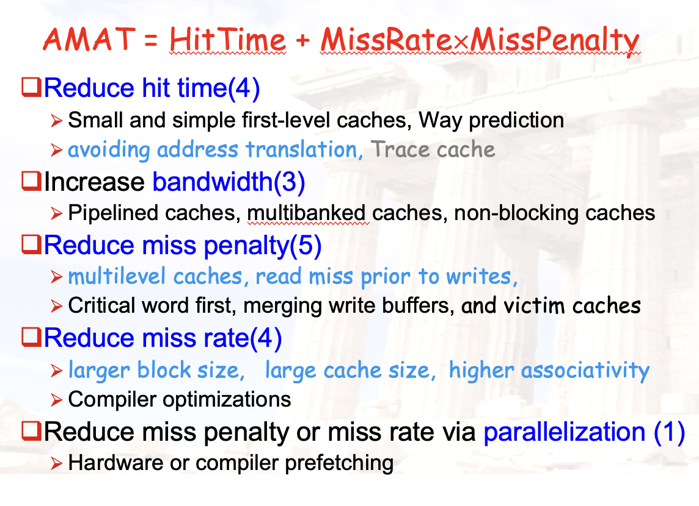
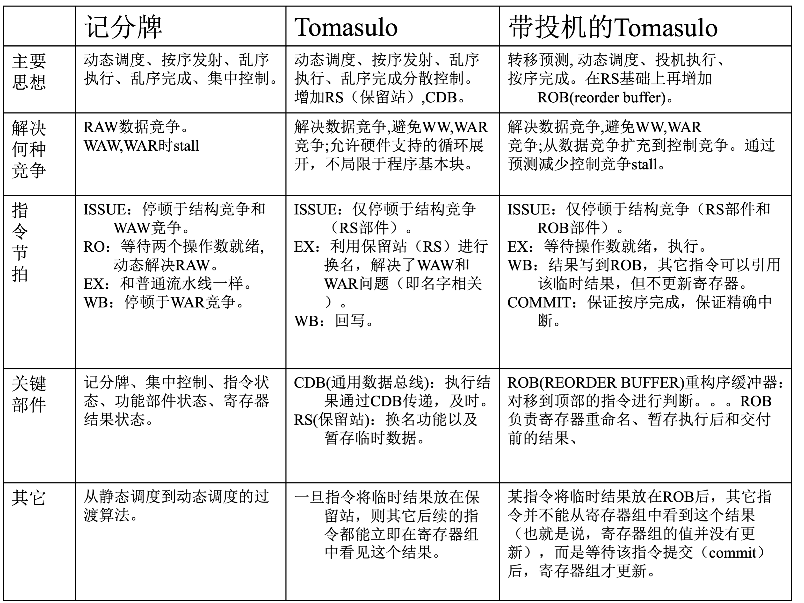

# Chapter 8：期末复习梳理

??? abstract "目录"
    - 知识点回顾与梳理
    - 考试技巧与经验分享

## 知识点回顾与梳理

### 学了什么？

从编程人员的视角出发，研究如何提高计算机的性能：

- Chapter 1：如何衡量与计算计算机性能
- Chapter 2：如何加快内存的访问速度
- Chapter 3：寻求指令之间的并行性
- Chapter 4：寻求数据之间的并行性
- Chapter 5：寻求线程之间的并行性

### Chapter 1：量化设计方法

**1. 计算机的分类**

- Flynn 分类法：SISD、SIMD、MISD、MIMD
- 标量与向量处理器：分别对应 Flynn 中的 ？
- 单处理器与多处理器：分别对应 Flynn 中的 ？
- UMA 与 NUMA 之间的区别
- Register Machine / Stack Machine / Accumulator Machine

**2. 计算机性能的量化**

- 执行时间
    - 总执行时间
    - 权重执行时间
    - 几何平均时间
- 可靠性
    - MTTF、MTTR、MTBF
- Amdahl 定律

### Chapter 2：层次化存储

**1. 存储系统基本概念与计算**

- 统一缓存、分离缓存（指令与数据）
- 缓存缺失分类：3C
- AMAT 的计算

**2. 存储性能优化（进阶版）**

**2. 缓存性能优化（进阶版）**

几个重点：

- 减少地址转换：三种缓存形式要知道原理
    - VIVT、PIPT、VIPT
- 多级缓存的计算
    - L1 的 Miss Penalty 就是 L2 的 AMAT
- 缓存块大小、缓存大小、关联度三个指标对性能的影响

### Chapter 3：指令级并行

**1. 拓展原来的流水线**

- 增加 FU 导致执行时间不一致
- 三种数据冲突
    - RAW、WAR、WAW
    - 谁是真正的数据依赖？谁是命名相关依赖？
    - 在本流水线中如何解决？
- 预约移位寄存器的设计

**2. 硬件方法：动态调度之 Scoreboard**

- 三张表
    - 指令状态表、FU 状态表、寄存器状态表
    - 各个 field 的含义
- 五个状态
    - IF、IS、RO、EX、WB
- 工作原理
    - 怎样看能不能发射？怎样看能不能执行？
- Scoreboard 的优点与缺点
    - 优化：显式寄存器重命名版本

**3. 硬件方法：动态调度之 Tomasulo**

- 核心思想
    - 与 Scoreboard 的区别
    - 隐式寄存器重命名
- 硬件结构
    - 指令状态表、寄存器状态表、各个 FU 的保留站
    - CDB 公共数据总线
- 四个阶段
    - IF、IS、EX、WB
- 工作原理
    - 怎样看能不能发射？怎样看能不能执行？

**4. 硬件方法：动态分支预测**

- 一位、两位预测器
    - 掌握状态机设计、预测成功率计算
- 相关预测器
    - 掌握大小计算
- 饱和预测器、BTB 等
    - 了解原理

**5. 硬件方法：猜测执行 Speculation**

- 原理与思想
    - 指令*提交*的概念
    - 可回滚：Reorder Buffer
- 工作过程
- 精确中断
    - 为什么带有 ROB 的 CPU 可以实现精确中断

**6. 硬件方法：超标量**

- 静态调度的 Superscalar
    - 概念
    - 性能问题
- 动态调度的 Superscalar
    - 执行过程
    - 解决同时写回冲突
- 带有猜测执行的 Superscalar
    - 按序提交

**7. 软件方法**

- 基本编译器优化
    - 循环展开与代码重排：会做
- 静态分支预测
- 静态多发射：VLIW
    - 了解原理、与 Superscalar 的区别
- 高级编译器优化技术
    - 软件流水线、全局代码调度
    - 相应的硬件技术辅助

### Chapter 4：数据级并行

- SIMD 概念
- 向量处理器
    - 结构
    - 优缺点
    - 向量长度概念与 Strip Mining
- 向量处理器性能提升
    - **向量链接**、条件执行、多道程序、Gather/Scatter
- GPU
    - 与向量处理器的区别

- Loop Level Parallelism（LLP）
    - 概念
    - 改写
    - 与向量链接技术相结合，性能计算

### Chapter 5：线程级并行

**1. 多处理器系统**

- 分类
    - 统一共享内存、分布式内存
    - UMA、NUMA
- 编程模型

**2. 缓存一致性**

- Snooping 监听协议
    - 原理：Invalid、Shared、Exclusive 三种状态
    - 状态机设计：CPU RW、BUS RW
    - **过程推导**
    - 拓展：MESI 协议（四种状态）
- Directory 目录协议
    - 三个 node 的概念
    - 三种状态
    - 访问过程

**3. 同步**

- 传统软件方法的问题
- 硬件手段：原子操作
    - Atomic Exchange、Test-And-Set、Fetch-And-Increment
    - RISC-V：LL&SC
- 互斥锁的实现
- 性能问题与优化方法

**4. 内存连续性**

- 连续性 Consistency 与一致性 Coherency 的区别
- 几个模型
    - 最严格的 Sequential Consistency
    - 逐步放宽：Total Store Order、Partial Store Order、Weak Consistency 等

## 考试技巧与经验分享

### 关于历年卷

- 我认为有价值的题目都已放在各个章节的 slides 中
    - 可以进小群看
- 近几年全部可以搜到的历年卷
    - https://www.cc98.org/topic/6082405
- **建议考前都做一遍，最重要的是熟悉题型**

### 关于考试

- 24 秋冬题型
    - 单项选择 40 * 1.5 = 60
        - 除了计算，还有很多概念题
    - 大题 40 分
        - 缓存计算（基本都是计组的知识）
        - 循环内依赖、寄存器重命名
        - 缓存一致性：MESI 协议
        - Scoreboard 过程推导
- 不出意外今年老师会发布各章节占比
    - 以最新消息为准

一些非常重要的知识点，可以说大题几乎是必考：

- 缓存性能计算
    - AMAT、Cache Miss Rate、Miss Penalty
    - 结合第一章的 CPU Time 计算
- 动态调度
    - Scoreboard、Tomasulo
    - 过程推导（填表），两个至少考一个
- 缓存一致性
    - 两种协议的的过程推导

- 不会很难
    - 与组成课不同，体系结构很多知识都是了解为主
    - 复习最重要的是理解重点部分的原理
- 题量不小
    - 做题注意把控时间

### 关于 A4 纸

- 按照老师的要求来
    - 如果要求手写就手写
    - 允许打印就打印
- 建议提前几天开始过一遍课程
    - 顺便完善自己的 A4 纸
    - 重点记自己不清楚的或是懒得背诵的

个人强烈建议：

- 缓存性能优化的 n 种策略
- 动态分支预测的几种实现
- 老师 PPT 的几张总结表
- 几种分类
    - Flynn 计算机种类分类
    - 多处理器的不同种类
    - ISA 的几种分类
- 我的 A4（供参考）：https://note.flyburg.cc/course/arch/
    - 基于大群郭嘉豪学长的 A4 纸改编而来
